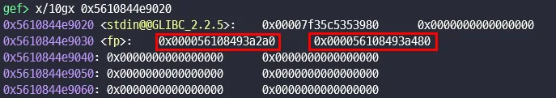
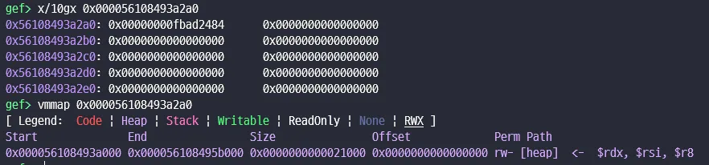
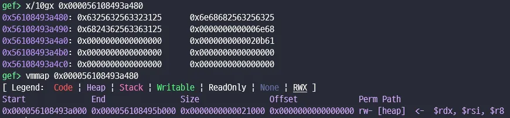
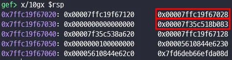
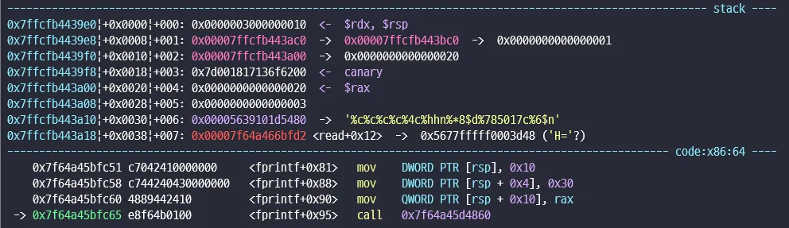
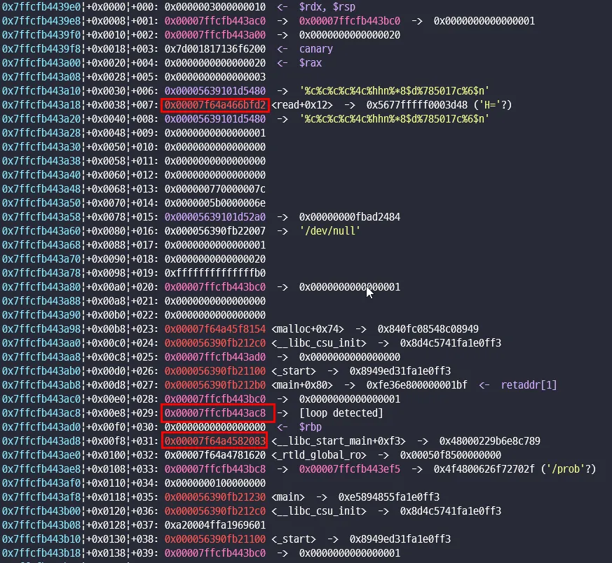

# Dreamhack starsb


## Binary analysis


```c
int __fastcall __noreturn main()
{
  void *ptr; // [rsp+8h] [rbp-8h] BYREF

  initialize();
  ptr = &ptr;
  fp = fopen("/dev/null", "wb");
  buf = (char *)malloc(0x20uLL);
  read(0, buf, 0x20uLL);
  fprintf(fp, buf);
  exit(1);
}
```

간단한 코드이다.  
취약점으로는 fprintf(fp, buf)에서 fsb 취약점이 발생한다.

fprintf 실행 전 변수 값


_bss 영역에 있는 변수_

fp 변수 값에서는 /dev/null의 파일 포인터가 저장되어 있고 다음 buf 변수에는 malloc 할당된 heap 주소가 저장되어 있다.

_fp 변수 값과 위치_


_buf 값과 위치_

fp와 buf는 둘다 heap에 위치해 있다.


_fprintf 실행 전 스택_

fprintf가 실행되기전 stack에 ptr이라는 변수가 저장되어 있다.  
이 변수에는 자기의 주소 값이 저장되어 있다.

fprintf에서 fsb취약점이 발생하는데 fp가 /dev/null 이기 때문에 출력은 불가능하고 %n은 가능하다.

---

## Exploit scenario

이 문제에서 main을 여러번 돌리면 풀수 있는 방법이 많이 떠올리지만 아무리 생각해도 exit 함수 내에서 main 함수를 실행 시킬 방법이 없다.

따라서 fsb 한번으로 shell 을 따야 한다….  
그러기 위해서는 문제에서 설정된 ptr이라는 변수를 잘 활용해야 한다.

libc 주소를 몰라도 libc 주소만큼 출력할수 있는 방법을 찾아야 한다.

바로 %\*$nc 를 사용하면 된다.

printf 계열 함수에서 width를 설정할 때 \*를 사용하면 인자를 참조해서 출력을 한다.

\* 기호를 사용하면 인자로 너비를 주어야 한다. 아래의 두 코드는 같은 출력을 나타낸다.

```c
printf("%*d", 5, 42);
printf("%5d", 42);
```

이 방법을 이용해서 offset이 8인 libc_ret 주소를 출력으로 바꿀 수 있다.,  
%\*8$c를 하면 libc 만큼 출력이 된다.

그럼 libc + oneshot 주소 만큼 출력할 수 있다. 그럼 이걸 어디에 저장해야 할까?


_fprintf 함수 내부_

fprintf 함수 내부에서 `_vprintf_internal` 이라는 함수를 실행할 때 rsp 영역에 read+0x12 가 보이고 이것은 libc 영역에 있는 코드이다.


_stack value_

따라서 처음 ptr이 있는 값을 우리가 oneshot 주소를 넣을 read+0x12가 저장된 스택 주소로 바꾸고 이 주소 값을 다시 oneshot 값을 넣는다!

```
[0x7ffcfb443ac8] -> 0x7ffcfb443a18
[0x7ffcfb443ac8] -> oneshot!
```

그러면 rsp + 0x38에 저장된 oneshot 주소가 `_vprintf_internal` 안에서 실행되 shell을 얻을 수 있다.

---


_실행 결과_

사실 bruteforce를 좀해야지 풀릴 것이다. 확률 싸움은 싫지만 1 / 32 확률이면 제법 합리적이다…

참조…

[**Zh3R0 CTF 2021**  
*We have a unique Format String bug in the software using fprintf. As all output is written to /dev/null, this is…*violenttestpen.github.io](https://violenttestpen.github.io/ctf/pwn/2021/06/06/zh3r0-ctf-2021/ "https://violenttestpen.github.io/ctf/pwn/2021/06/06/zh3r0-ctf-2021/")
