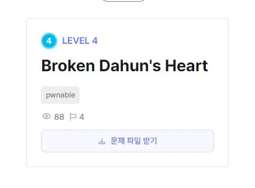
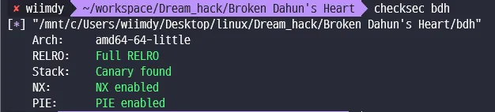
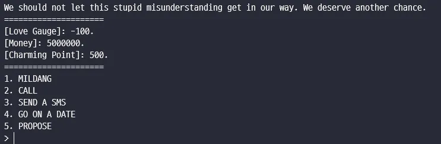
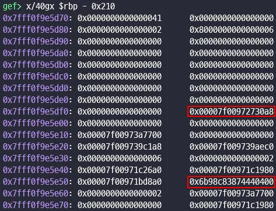
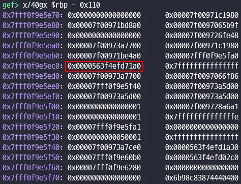
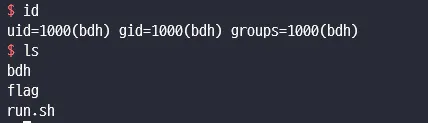

# Broken Dahun’s Heart



## Binary analysis



checksec binary


binary를 실행 하면 게임처럼 선택을 할 수 있다.

결론적으로 쉘을 얻는 방법은 이러하다

```cpp
void propose(void)
{
  __int64 v0; // rax
  __int64 v1; // rax
  __int64 v2; // rax
  __int64 v3; // rax
  __int64 v4; // rax
  unsigned int ran; // [rsp+Ch] [rbp-4h]

  game_step = 5LL;
  if ( money <= 99999 )
  {
    v0 = std::operator<<<std::char_traits<char>>(&std::cout, "No more money for the ring:(");
    std::ostream::operator<<(v0, &std::endl<char,std::char_traits<char>>);
    broke_again();
  }
  money -= 100000;
  ran = rand();
  if ( !(ran % 200000000) && charming > 100000 )// ran == 2000000000
  {
    v1 = std::operator<<<std::char_traits<char>>(&std::cout, "Oh!");
    v2 = std::ostream::operator<<(v1, ran);
    std::ostream::operator<<(v2, &std::endl<char,std::char_traits<char>>);
    get_back_together();                        // shell
  }
  v3 = std::operator<<<std::char_traits<char>>(&std::cout, "-_-");
  v4 = std::ostream::operator<<(v3, ran);
  std::ostream::operator<<(v4, &std::endl<char,std::char_traits<char>>);
  broke_again();
}
```

rand() 값이 200000000의 배수이고 charming 포인트가 100000가 넘어야 한다.  
사실상 불가능한 값이지 않을까 싶다..

```cpp
int __fastcall __noreturn main()
{
  __int64 v0; // rax
  unsigned int val; // [rsp+18h] [rbp-A8h] BYREF
  int fd; // [rsp+1Ch] [rbp-A4h]
  struct sigaction s; // [rsp+20h] [rbp-A0h] BYREF
  unsigned __int64 canary; // [rsp+B8h] [rbp-8h]

  canary = __readfsqword(0x28u);
  setvbuf(stdin, 0LL, 2, 0LL);
  setvbuf(stdout, 0LL, 2, 0LL);
  print_hi();
  alarm(300u);
  init_handles();
  val = 0;
  fd = open("/dev/urandom", 0);
  read(fd, &val, 2uLL);
  close(fd);
  srand(val);
  memset(&s, 0, sizeof(s));
  s.sa_flags = 4;
  s.sa_handler = heal_the_borken_heart;
  sigaction(11, &s, 0LL);                       // signal == sigsegv heal the broken heart
  memset(&s, 0, sizeof(s));
  s.sa_flags = 4;
  s.sa_handler = signal_handler;
  sigaction(14, &s, 0LL);
  v0 = std::operator<<<std::char_traits<char>>(
         &std::cout,
         "We should not let this stupid misunderstanding get in our way. We deserve another chance.");
  std::ostream::operator<<(v0, &std::endl<char,std::char_traits<char>>);
  try_again();
}
```

main 함수에서 srand의 seed 값을 /dev/urandom에서 읽어왔다.

libc, code base , canary leak..

```cpp
  std::operator<<<std::char_traits<char>>(&std::cout, "Phone number: ");
  read(0, phone_num, 255uLL);
  std::operator<<<std::char_traits<char>>(&std::cout, "Message: ");
  read(0, msg, 255uLL);
  v1 = std::operator<<<std::char_traits<char>>(&std::cout, "[");
  v2 = std::operator<<<std::char_traits<char>>(v1, phone_num);// phone_num
  v3 = std::operator<<<std::char_traits<char>>(v2, "]");
  std::ostream::operator<<(v3, &std::endl<char,std::char_traits<char>>);
  v4 = std::operator<<<std::char_traits<char>>(&std::cout, msg);
  std::ostream::operator<<(v4, &std::endl<char,std::char_traits<char>>);// msg
  v5 = std::operator<<<std::char_traits<char>>(&std::cout, "Sent!");
  std::ostream::operator<<(v5, &std::endl<char,std::char_traits<char>>);
  if ( rand() % 10 )
  {
    v9 = std::operator<<<std::char_traits<char>>(&std::cout, "Oh !!!!!!!!!! She did not replied,, ,, :(!");
    std::ostream::operator<<(v9, &std::endl<char,std::char_traits<char>>);
  }
```

이 부분에서 stack leak이 가능하다. phone_num, msg변수들이 초기화가 되지 않아 스택에 여러 주소들이 있다.



phone_num stack leak



msg stack leak

변수를 출력하는 함수에서 사이즈 맞게 dummy 값을 맞추면 stack, canary, code 주소 leak이 가능하다.

그럼 ret 주소를 덮을 곳이 있는지 찾아봐서 덮는다.

```cpp
  std::operator<<<std::char_traits<char>>(&std::cout, "> ");
  std::operator>><char,std::char_traits<char>>(&std::cin, inpt);
  switch ( atoi(inpt) )
```

cin을 이용하여 inpt에 입력을 받기 때문에 무한으로 입력이 가능하다.

---


