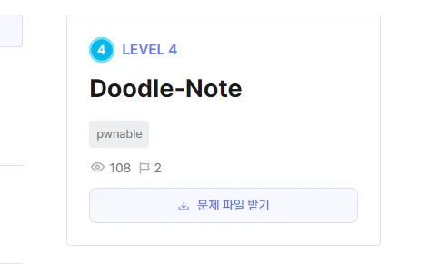
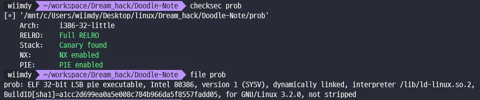
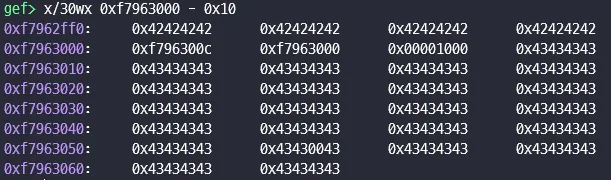
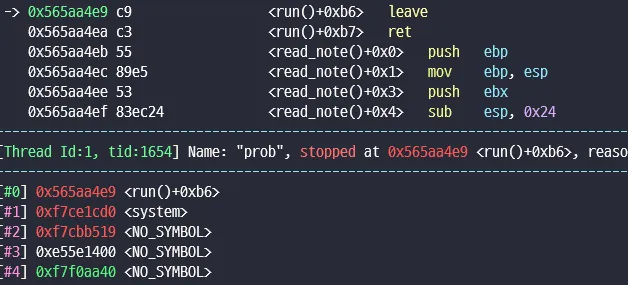
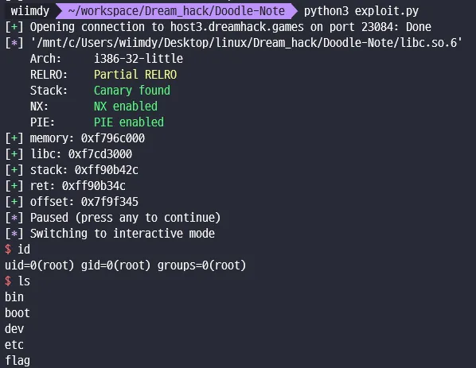

# [Dreamhack] Doodle-note



## Binary analysis



이 문제는 신선하게 32bit 문제이다.

FULL RELRO이니 hook을 덮는 것을 생각해야 한다.

```cpp
void Doodle::read_doodle() {
    cout << "<Read Doodle>\n";

    size_t page_idx;
    cout << "Page Index > ";
    input_int(page_idx);
    page_idx %= MAX_PAGE_NUM;
    char * contents = note->get_contents(page_idx);
    if (contents == nullptr) {
        return;
    }
    size_t contents_size = note->get_page_size(page_idx);
    if (contents_size == 0) {
        return;
    }
    size_t contents_offset;
    cout << "Doodle Offset > ";
    input_int(contents_offset);
    if (contents_offset >= contents_size) {
        cout << "[!] No Hack!\n";
        return;
    }
    cout << "Doodle: ";
    write(1, &contents[contents_offset], 8);
}

void Doodle::lets_doodle() {
    cout << "<Let's Doodle!>\n";

    size_t page_idx;
    cout << "Page Index > ";
    input_int(page_idx);
    page_idx %= MAX_PAGE_NUM;
    char * contents = note->get_contents(page_idx);
    if (contents == nullptr) {
        return;
    }
    size_t contents_size = note->get_page_size(page_idx);
    if (contents_size == 0) {
        return;
    }
    size_t contents_offset;
    cout << "Doodle Offset > ";
    input_int(contents_offset);
    if (contents_offset >= contents_size) {
        cout << "[!] No Hack!\n";
        return;
    }
    cout << "Doodle! > ";
    cin.read(&contents[contents_offset], 4);
    cin.ignore(numeric_limits<streamsize>::max(), '\n');
}
```

이 문제에 취약점이라고 할 수 있는 곳은 Doodle Class 안에 content 내용을 마음대로 바꿀수 있고 읽을 수 있다.  
offset을 크게 하면 contents_size 검사에서 걸리기 때문에 content_size를 크게 만들 수 있으면 offset을 크게 해서 leak이 가능하다.

```cpp
void Note::add_page(const string &contents) {
    if (contents.size() > page_size) {

```

add_page를 할 때 size를 받아 mmap을 통해 할당을 받는다. 하지만   
content size만큼 할당했지만 content 시작할 때는 addr + 0xc만큼이기 때문에 다음 청크에 overflow가 발생한다.



따라서 다른 청크에 있는 addr를 읽을 수 있다. 그럼 offset을 통해 libc 주소를 읽을 수 있다.   
그럼 environ 에 있는 주소를 읽어 stack 주소를 leak 할 수 있다.

stack ret 주소에 offset을 구해 rop 체인을 만들어 덮어 준다.



---


