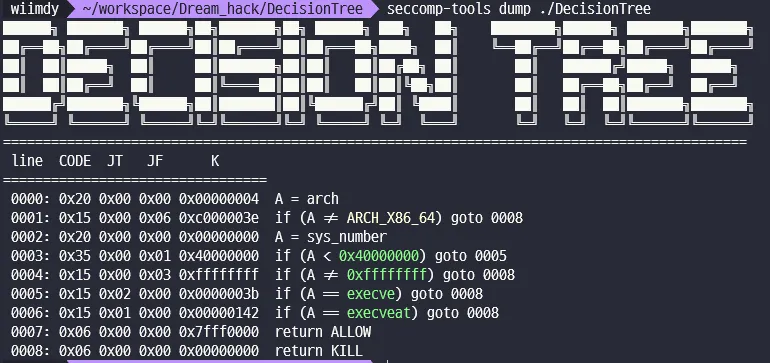
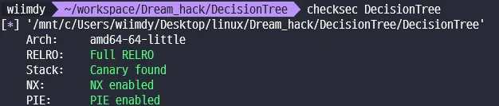

# [Dreamhack] DecisionTree

```c
int __fastcall main()
{
  unsigned int inp; // [rsp+0h] [rbp-10h] BYREF
  int check; // [rsp+4h] [rbp-Ch]
  unsigned __int64 canary; // [rsp+8h] [rbp-8h]

  canary = __readfsqword(0x28u);
  Init();
  banned_execve();
  check = 0;
  while ( !check )
  {
    print_menu();
    __isoc99_scanf("%d", &inp);
    switch ( inp )
    {
      case 1u:
        traverseTree(1, add_node);
        break;
      case 2u:
        edit_node();
        break;
      case 3u:
        delete_node();
        break;
      case 4u:
        traverseTree(1, Make_Decision);
        break;
      case 5u:
        destroyTree();
        check = 1;
        break;
      default:
        printf("There is no [%d] in menu ~_~\n", inp);
        break;
    }
  }
  munmap(root, 0x100uLL);
  return 0;
}

__int64 __fastcall add_node(unsigned int leap_num)
{
  struct node *node; // rbx
  char *rval; // rcx
  signed int ilen; // eax
  unsigned int size; // [rsp+10h] [rbp-20h] BYREF
  signed int input_len; // [rsp+14h] [rbp-1Ch]
  unsigned __int64 canary; // [rsp+18h] [rbp-18h]

  canary = __readfsqword(0x28u);
  size = 0;
  if ( root[leap_num].ptr )
  {
    printf("[%d]: %s\nAdd Question(Answer) for ", leap_num, root[leap_num].ptr);
    return YesNo();
  }
  else
  {
    if ( isExternal(leap_num) )
      printf("Size of Answer: ");
    else
      printf("Size of Question: ");
    __isoc99_scanf("%u", &size);
    if ( size <= 0x1000 )
    {
      node = &root[leap_num];
      node->ptr = malloc(size);
      printf("Data: ");
      input_len = 0;
      do
      {
        read(0, root[leap_num].ptr + input_len, 1uLL);
        rval = root[leap_num].ptr;
        ilen = input_len++;
      }
      while ( rval[ilen] != '\n' && input_len < size );
      *(root[leap_num].ptr + input_len) = 0;
      *&root[leap_num].len = strlen(root[leap_num].ptr);
      puts("Successfully Added");
      return 0LL;
    }
    else
    {
      puts("invalid size");
      return 0LL;
    }
  }
}

_BOOL8 __fastcall isExternal(int leap)
{
  return 2 * leap + 1 >= cnt;
}

void __fastcall traverseTree(int leap_num, __int64 (__fastcall *func)(_QWORD))
{
  char v2; // [rsp+1Fh] [rbp-1h]

  if ( leap_num < cnt && leap_num > 0 && func )
  {
    v2 = func(leap_num);
    if ( v2 == '<' )
    {
      traverseTree(2 * leap_num, func);
    }
    else if ( v2 == '>' )
    {
      traverseTree(2 * leap_num + 1, func);
    }
  }
}

void __fastcall edit_node()
{
  unsigned int idx; // [rsp+4h] [rbp-Ch] BYREF
  unsigned __int64 v1; // [rsp+8h] [rbp-8h]

  v1 = __readfsqword(0x28u);
  idx = 0;
  printf("Node's idx: ");
  __isoc99_scanf("%u", &idx);
  if ( idx < cnt && root[idx].ptr )
  {
    printf("New Data: ");
    if ( read(0, root[idx].ptr, *&root[idx].len) > 0 )
      puts("Successfully Edited");
  }
  else
  {
    puts("invalid index");
  }
}

void __fastcall delete_node()
{
  unsigned int idx; // [rsp+4h] [rbp-Ch] BYREF
  unsigned __int64 v1; // [rsp+8h] [rbp-8h]

  v1 = __readfsqword(0x28u);
  idx = 0;
  printf("Node's idx: ");
  __isoc99_scanf("%u", &idx);
  if ( idx < cnt && root[idx].ptr )
  {
    free(root[idx].ptr);
    root[idx].ptr = 0LL;
    *&root[idx].len = 0;
    puts("Successfully Deleted");
  }
  else
  {
    puts("invalid index");
  }
}

void __fastcall Make_Decision(unsigned int leap_num)
{
  if ( root[leap_num].ptr )
  {
    printf("[%d]: %s\n", leap_num, root[leap_num].ptr);
    YesNo();
  }
}

void __fastcall destroyTree()
{
  int i; // [rsp+Ch] [rbp-4h]

  for ( i = 1; i < cnt; ++i )
  {
    if ( root[i].ptr )
      free(root[i].ptr);
  }
}
```





vmmap 한 공간에 실행 권한이 있다.

heap 영역을 0x10000에서 관리 하기 때문에 heap 기법 중 unsafe-unlink 가 떠오른다.

tcache에서는 unlink가 일어나지 않기 때문에 unsorted bin 을 만든 다음에 fake 청크를 만들어 unsafe-unlink가 일어날수 있도록 만든다.

free_hook 을 우리가 원하는 shell code가 적힌 0x10020? 영역으로 옮기면 shell code가 실행된다.

여기서 execve가 ban 당했기 때문에 orw 를 이용한다.
