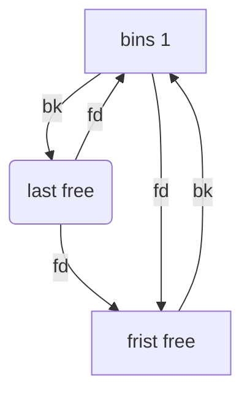

## 기본적인 구조

## struct malloc_chunk

```c
struct malloc_chunk {

  INTERNAL_SIZE_T      mchunk_prev_size;  /* Size of previous chunk (if free).  */
  INTERNAL_SIZE_T      mchunk_size;       /* Size in bytes, including overhead. */

  struct malloc_chunk* fd;         /* double links -- used only if free. */
  struct malloc_chunk* bk;

  /* Only used for large blocks: pointer to next larger size.  */
  struct malloc_chunk* fd_nextsize; /* double links -- used only if free. */
  struct malloc_chunk* bk_nextsize;
};
```

#### malloc_chunk details

일반적인 할당된 chunk의 구조는 다음과 같다:

    chunk-> +-+-+-+-+-+-+-+-+-+-+-+-+-+-+-+-+-+-+-+-+-+-+-+-+-+-+-+-+-+-+-+-+
        |             Size of previous chunk, if unallocated (P clear)  |
        +-+-+-+-+-+-+-+-+-+-+-+-+-+-+-+-+-+-+-+-+-+-+-+-+-+-+-+-+-+-+-+-+
        |             Size of chunk, in bytes                     |A|M|P|
      mem-> +-+-+-+-+-+-+-+-+-+-+-+-+-+-+-+-+-+-+-+-+-+-+-+-+-+-+-+-+-+-+-+-+
        |             User data starts here...                          .
        .                                                               .
        .             (malloc_usable_size() bytes)                      .
        .                                                               |
    nextchunk-> +-+-+-+-+-+-+-+-+-+-+-+-+-+-+-+-+-+-+-+-+-+-+-+-+-+-+-+-+-+-+-+-+
        |             (size of chunk, but used for application data)    |
        +-+-+-+-+-+-+-+-+-+-+-+-+-+-+-+-+-+-+-+-+-+-+-+-+-+-+-+-+-+-+-+-+
        |             Size of next chunk, in bytes                |A|0|1|
        +-+-+-+-+-+-+-+-+-+-+-+-+-+-+-+-+-+-+-+-+-+-+-+-+-+-+-+-+-+-+-+-+

- 여기서 "chunk"는 대부분의 malloc 코드에서 청크의 앞부분이지만 "mem"은 사용자에게 반환되는 포인터입니다.
  "next chunk"는 연속된 다음 청크의 시작 부분입니다.

- 청크는 항상 짝수 단어 경계에서 시작하므로 사용자에게 반환되는 mem 부분도 짝수 단어 경계에 있으므로 적어도 두 단어 이상 정렬됩니다.

"free chunk"는 이중으로 연결된 원형 목록에 저장되며 다음과 같이 보입니다:

    chunk-> +-+-+-+-+-+-+-+-+-+-+-+-+-+-+-+-+-+-+-+-+-+-+-+-+-+-+-+-+-+-+-+-+
        |             Size of previous chunk, if unallocated (P clear)  |
        +-+-+-+-+-+-+-+-+-+-+-+-+-+-+-+-+-+-+-+-+-+-+-+-+-+-+-+-+-+-+-+-+
    `head:' |             Size of chunk, in bytes                     |A|0|P|
      mem-> +-+-+-+-+-+-+-+-+-+-+-+-+-+-+-+-+-+-+-+-+-+-+-+-+-+-+-+-+-+-+-+-+
        |             Forward pointer to next chunk in list             |
        +-+-+-+-+-+-+-+-+-+-+-+-+-+-+-+-+-+-+-+-+-+-+-+-+-+-+-+-+-+-+-+-+
        |             Back pointer to previous chunk in list            |
        +-+-+-+-+-+-+-+-+-+-+-+-+-+-+-+-+-+-+-+-+-+-+-+-+-+-+-+-+-+-+-+-+
        |             Unused space (may be 0 bytes long)                .
        .                                                               .
        .                                                               |
    nextchunk-> +-+-+-+-+-+-+-+-+-+-+-+-+-+-+-+-+-+-+-+-+-+-+-+-+-+-+-+-+-+-+-+-+
    `foot:' |             Size of chunk, in bytes                           |
        +-+-+-+-+-+-+-+-+-+-+-+-+-+-+-+-+-+-+-+-+-+-+-+-+-+-+-+-+-+-+-+-+
        |             Size of next chunk, in bytes                |A|0|0|
        +-+-+-+-+-+-+-+-+-+-+-+-+-+-+-+-+-+-+-+-+-+-+-+-+-+-+-+-+-+-+-+-+

- 청크 크기의 미사용 하위 비트(항상 두 단어의 배수)에 저장되는 P(PREV*INUSE) 비트는 *이전\_ 청크의 사용 중인 비트입니다.
- 이 비트가 *클리어*이면 현재 청크 크기 앞의 단어에 이전 청크 크기가 포함되어 있으며 이전 청크의 앞부분을 찾는 데 사용할 수 있습니다.
- 할당된 첫 번째 청크는 항상 이 비트가 설정되어 있어 존재하지 않는(또는 소유하지 않은) 메모리에 대한 액세스를 방지합니다.
- 특정 청크에 대해 prev_inuse가 설정되어 있으면 이전 청크의 크기를 확인할 수 없으며, 이를 시도할 때 메모리 주소 지정 오류가 발생할 수도 있습니다.

- main_arena 변수로 설명되는 초기 메인 아레나의 청크에 대해서는 A(NON_MAIN_ARENA) 비트가 지워집니다.
- 추가 스레드가 생성되면 각 스레드는 자체 아레나(구성 가능한 한도까지, 그 이후에는 여러 스레드에 아레나가 재사용됨)를 받고, 이러한 아레나의 청크에는 A 비트가 설정됩니다.
- 이러한 비메인 아레나에서 청크의 아레나를 찾기 위해, heap_for_ptr은 힙별 헤더 heap_info의 ar_ptr 멤버를 통해 비트 마스크 연산과 방향 전환을 수행합니다(arena.c 참조).

---

현재 청크의 'foot'는 실제로는 다음 청크의 prev_size로 표현된다는 점에 유의하세요. 이렇게 하면 정렬 등을 처리하기가 더 쉬워지지만 이 코드를 확장하거나 수정하려고 할 때 매우 혼란스러울 수 있습니다.

이 모든 것의 세 가지 예외는 다음과 같습니다:

1.  특수 청크 'top'은 색인을 생성해야 하는 다음 연속 청크가 없으므로 후행 크기 필드를 사용할 필요가 없습니다. 초기화 후에는 `top'이 항상 존재하도록 강제됩니다. 길이가 MINSIZE 바이트보다 작아지면 보충됩니다.

2.  mmap을 통해 할당된 청크는 크기 필드에 두 번째로 낮은 차수 비트 M(IS_MMAPPED)이 설정되어 있습니다. 청크는 하나씩 할당되므로 각각 고유한 후행 크기 필드를 포함해야 합니다. M 비트가 설정되면 다른 비트는 무시됩니다(매핑된 청크는 아레나에 있지 않거나 해제된 청크에 인접하지 않기 때문입니다). M 비트는 원래 hooks.c의 malloc_set_state를 통해 덤프된 힙에서 가져온 청크에도 사용됩니다.

3.  패스트빈의 청크는 청크 할당자의 관점에서 할당된 청크로 취급됩니다. 청크는 malloc_consolidate를 통해 이웃 청크와 일괄적으로만 통합됩니다.

---

### 매크로 표현들

```c
---------- Size and alignment checks and conversions ----------

/* conversion from malloc headers to user pointers, and back */

#define chunk2mem(p)   ((void*)((char*)(p) + 2*SIZE_SZ))
#define mem2chunk(mem) ((mchunkptr)((char*)(mem) - 2*SIZE_SZ))

/* The smallest possible chunk */
#define MIN_CHUNK_SIZE        (offsetof(struct malloc_chunk, fd_nextsize))

/* The smallest size we can malloc is an aligned minimal chunk */

#define MINSIZE  \
  (unsigned long)(((MIN_CHUNK_SIZE+MALLOC_ALIGN_MASK) & ~MALLOC_ALIGN_MASK))

/* Check if m has acceptable alignment */

#define aligned_OK(m)  (((unsigned long)(m) & MALLOC_ALIGN_MASK) == 0)

#define misaligned_chunk(p) \
  ((uintptr_t)(MALLOC_ALIGNMENT == 2 * SIZE_SZ ? (p) : chunk2mem (p)) \
   & MALLOC_ALIGN_MASK)


/*
   Check if a request is so large that it would wrap around zero when
   padded and aligned. To simplify some other code, the bound is made
   low enough so that adding MINSIZE will also not wrap around zero.
 */

#define REQUEST_OUT_OF_RANGE(req)                                 \
  ((unsigned long) (req) >=						      \
   (unsigned long) (INTERNAL_SIZE_T) (-2 * MINSIZE))

/* pad request bytes into a usable size -- internal version */

#define request2size(req)                                         \
  (((req) + SIZE_SZ + MALLOC_ALIGN_MASK < MINSIZE)  ?             \
   MINSIZE :                                                      \
   ((req) + SIZE_SZ + MALLOC_ALIGN_MASK) & ~MALLOC_ALIGN_MASK)

/* Same, except also perform an argument and result check.  First, we check
   that the padding done by request2size didn't result in an integer
   overflow.  Then we check (using REQUEST_OUT_OF_RANGE) that the resulting
   size isn't so large that a later alignment would lead to another integer
   overflow.  */
#define checked_request2size(req, sz) \
({				    \
  (sz) = request2size (req);	    \
  if (((sz) < (req))		    \
      || REQUEST_OUT_OF_RANGE (sz)) \
    {				    \
      __set_errno (ENOMEM);	    \
      return 0;			    \
    }				    \
})

/*
   --------------- Physical chunk operations ---------------
 */


/* size field is or'ed with PREV_INUSE when previous adjacent chunk in use */
#define PREV_INUSE 0x1

/* extract inuse bit of previous chunk */
#define prev_inuse(p)       ((p)->mchunk_size & PREV_INUSE)


/* size field is or'ed with IS_MMAPPED if the chunk was obtained with mmap() */
#define IS_MMAPPED 0x2

/* check for mmap()'ed chunk */
#define chunk_is_mmapped(p) ((p)->mchunk_size & IS_MMAPPED)


/* size field is or'ed with NON_MAIN_ARENA if the chunk was obtained
   from a non-main arena.  This is only set immediately before handing
   the chunk to the user, if necessary.  */
#define NON_MAIN_ARENA 0x4

/* Check for chunk from main arena.  */
#define chunk_main_arena(p) (((p)->mchunk_size & NON_MAIN_ARENA) == 0)

/* Mark a chunk as not being on the main arena.  */
#define set_non_main_arena(p) ((p)->mchunk_size |= NON_MAIN_ARENA)


/*
   Bits to mask off when extracting size

   Note: IS_MMAPPED is intentionally not masked off from size field in
   macros for which mmapped chunks should never be seen. This should
   cause helpful core dumps to occur if it is tried by accident by
   people extending or adapting this malloc.
 */
#define SIZE_BITS (PREV_INUSE | IS_MMAPPED | NON_MAIN_ARENA)

/* Get size, ignoring use bits */
#define chunksize(p) (chunksize_nomask (p) & ~(SIZE_BITS))

/* Like chunksize, but do not mask SIZE_BITS.  */
#define chunksize_nomask(p)         ((p)->mchunk_size)

/* Ptr to next physical malloc_chunk. */
#define next_chunk(p) ((mchunkptr) (((char *) (p)) + chunksize (p)))

/* Size of the chunk below P.  Only valid if prev_inuse (P).  */
#define prev_size(p) ((p)->mchunk_prev_size)

/* Set the size of the chunk below P.  Only valid if prev_inuse (P).  */
#define set_prev_size(p, sz) ((p)->mchunk_prev_size = (sz))

/* Ptr to previous physical malloc_chunk.  Only valid if prev_inuse (P).  */
#define prev_chunk(p) ((mchunkptr) (((char *) (p)) - prev_size (p)))

/* Treat space at ptr + offset as a chunk */
#define chunk_at_offset(p, s)  ((mchunkptr) (((char *) (p)) + (s)))

/* extract p's inuse bit */
#define inuse(p)							      \
  ((((mchunkptr) (((char *) (p)) + chunksize (p)))->mchunk_size) & PREV_INUSE)

/* set/clear chunk as being inuse without otherwise disturbing */
#define set_inuse(p)							      \
  ((mchunkptr) (((char *) (p)) + chunksize (p)))->mchunk_size |= PREV_INUSE

#define clear_inuse(p)							      \
  ((mchunkptr) (((char *) (p)) + chunksize (p)))->mchunk_size &= ~(PREV_INUSE)


/* check/set/clear inuse bits in known places */
#define inuse_bit_at_offset(p, s)					      \
  (((mchunkptr) (((char *) (p)) + (s)))->mchunk_size & PREV_INUSE)

#define set_inuse_bit_at_offset(p, s)					      \
  (((mchunkptr) (((char *) (p)) + (s)))->mchunk_size |= PREV_INUSE)

#define clear_inuse_bit_at_offset(p, s)					      \
  (((mchunkptr) (((char *) (p)) + (s)))->mchunk_size &= ~(PREV_INUSE))


/* Set size at head, without disturbing its use bit */
#define set_head_size(p, s)  ((p)->mchunk_size = (((p)->mchunk_size & SIZE_BITS) | (s)))

/* Set size/use field */
#define set_head(p, s)       ((p)->mchunk_size = (s))

/* Set size at footer (only when chunk is not in use) */
#define set_foot(p, s)       (((mchunkptr) ((char *) (p) + (s)))->mchunk_prev_size = (s))


#pragma GCC poison mchunk_size
#pragma GCC poison mchunk_prev_size
```

### Unsorted chunks

청크 분할에서 남은 `reminder chunk`와 반환된 모든 청크는 먼저 `unsorted bin`에 배치됩니다.

그런 다음 malloc이 binning하기 전에 한 번의 사용 기회를 부여한 후 `regular bin`에 배치됩니다.

따라서 기본적으로 `unsorted_chunks` 목록은 대기열 역할을 하며, 청크는 free(및 malloc_consolidate)를 통해 삽입되고 malloc에서 제거(사용 또는 빈에 배치)됩니다.

정렬되지 않은 청크에는 `NON_MAIN_ARENA` 플래그가 설정되지 않으므로 크기 비교에서 이를 고려할 필요가 없습니다.

### Top

사용 가능한 최상위 청크(즉, 사용 가능한 메모리의 끝에 접한 청크)는 특별하게 취급됩니다.

이 청크는 어떤 빈에도 포함되지 않고, 다른 청크가 없는 경우에만 사용되며, 크기가 매우 큰 경우 시스템에 다시 반환됩니다(M_TRIM_THRESHOLD 참조).

top은 처음에 초기 크기가 0인 자체 빈을 가리키기 때문에 첫 번째 malloc 요청 시 강제로 확장되므로, top chunk 존재 여부를 확인하기 위해 malloc에 특별한 코드를 넣지 않아도 됩니다.

하지만 시스템에서 메모리를 가져올 때는 여전히 malloc을 해야 하므로 초기화와 sysmalloc에 대한 첫 번째 호출 사이의 간격 동안 initial_top이 해당 빈을 합법적이지만 사용할 수 없는 청크로 취급하도록 합니다.

(이 간격 동안에도 앞의 두 word가 0이어야 하기 때문에 다소 섬세합니다.)
편리하게도, 정렬되지 않은 빈을 첫 번째 호출에서 더미 상단으로 사용할 수 있습니다

`#define initial_top(M) (unsorted_chunks (M))`.

### Binmap

많은 수의 빈을 보완하기 위해 one-level 인덱스 구조가 빈 단위 검색에 사용됩니다. `binmap` 은 트래버스 중에 건너뛸 수 있도록 빈이 확실히 비어 있는지 여부를 기록하는 비트벡터입니다.

빈이 비워지는 즉시 비트가 항상 지워지는 것이 아니라 malloc에서 순회하는 동안 빈이 비어 있는 것으로 확인된 경우에만 비트가 지워집니다.

```c
/*Conservatively use 32 bits per map word, even if on 64bit system */
#define BINMAPSHIFT      5
#define BITSPERMAP       (1U << BINMAPSHIFT)
#define BINMAPSIZE       (NBINS / BITSPERMAP)

#define idx2block(i)     ((i) >> BINMAPSHIFT)
#define idx2bit(i)       ((1U << ((i) & ((1U << BINMAPSHIFT) - 1))))

#define mark_bin(m, i)    ((m)->binmap[idx2block (i)] |= idx2bit (i))
#define unmark_bin(m, i)  ((m)->binmap[idx2block (i)] &= ~(idx2bit (i)))
#define get_binmap(m, i)  ((m)->binmap[idx2block (i)] & idx2bit (i))
```

binmap은 bins를 4(BINMAPSIZE)개의 영역으로 나누어서 정보를 배치합니다.

- binmap[0] : 0 ~ 31, binmap[1] : 32 ~ 64, binmap[2] : 65 ~ 96, binmap[3] : 97 ~128
- bins[]에 free chunk가 배치되면, binmap[]에는 그 bin이 해당하는 위치에 해당 bin의 bit가 배치됩니다.
- 예를 들어 크기가 256byte인 free chunk의 인덱스는 65이며, binmap[2]에 bit정보가 저장됩니다.
- 할당자는 idx2bit() 함수를 이용하여 저장할 bit값을 계산합니다.
- binmap[2]에는 2(1 << (index(65) & 31))가 배치됩니다.
- binmap[] 배열을 사용하면 많은양의 빈 검색이 간소화됩니다.

### Fastbins

최근에 해제된 작은 청크를 보관하는 목록 배열입니다. `fastbin`은 이중으로 연결되지 않습니다.

단일 링크하는 것이 더 빠르며, 이러한 목록의 중간에서 청크가 제거되지 않으므로 이중 링크가 필요하지 않습니다.

또한 regular bin과 달리 fastbin은 일반적으로 fastbin이 사용되는 일시적인 상황에서는 순서가 크게 중요하지 않기 때문에 FIFO 순서로 처리되지도 않습니다(더 빠른 LIFO를 사용합니다).

fastbin의 청크는 `inuse bit`가 설정되어 있으므로 다른 사용 가능한 청크와 통합할 수 없습니다.

malloc_consolidate는 패스트빈의 모든 청크를 해제하고 다른 사용 가능한 청크와 통합합니다.

```c
typedef struct malloc_chunk *mfastbinptr;
#define fastbin(ar_ptr, idx) ((ar_ptr)->fastbinsY[idx])

/* offset 2 to use otherwise unindexable first 2 bins */
#define fastbin_index(sz) \
  ((((unsigned int) (sz)) >> (SIZE_SZ == 8 ? 4 : 3)) - 2)


/* The maximum fastbin request size we support */
#define MAX_FAST_SIZE     (80 * SIZE_SZ / 4)

#define NFASTBINS  (fastbin_index (request2size (MAX_FAST_SIZE)) + 1)
```

```c
static INTERNAL_SIZE_T global_max_fast;

/*
   Set value of max_fast.
   Use impossibly small value if 0.
   Precondition: there are no existing fastbin chunks in the main arena.
   Since do_check_malloc_state () checks this, we call malloc_consolidate ()
   before changing max_fast.  Note other arenas will leak their fast bin
   entries if max_fast is reduced.
 */

#define set_max_fast(s) \
  global_max_fast = (((s) == 0)						      \
                     ? SMALLBIN_WIDTH : ((s + SIZE_SZ) & ~MALLOC_ALIGN_MASK))

static inline INTERNAL_SIZE_T
get_max_fast (void)
{
  /* Tell the GCC optimizers that global_max_fast is never larger
     than MAX_FAST_SIZE.  This avoids out-of-bounds array accesses in
     _int_malloc after constant propagation of the size parameter.
     (The code never executes because malloc preserves the
     global_max_fast invariant, but the optimizers may not recognize
     this.)  */
  if (global_max_fast > MAX_FAST_SIZE)
    __builtin_unreachable ();
  return global_max_fast;
}
```

`global_max_fast` 이란 변수는 fastbin이 가질 수 있는 최대 크기를 정하고 있다. 기본적으로 0x80이 설정되어 있지만 `set_max_fast` 라는 함수로 정할 수 있다.

### struct malloc_state

```c
struct malloc_state
{
  /* Serialize access.  */
  __libc_lock_define (, mutex);

  /* Flags (formerly in max_fast).  */
  int flags;

  /* Set if the fastbin chunks contain recently inserted free blocks.  */
  /* Note this is a bool but not all targets support atomics on booleans.  */
  int have_fastchunks;

  /* Fastbins */
  mfastbinptr fastbinsY[NFASTBINS];

  /* Base of the topmost chunk -- not otherwise kept in a bin */
  mchunkptr top;

  /* The remainder from the most recent split of a small request */
  mchunkptr last_remainder;

  /* Normal bins packed as described above */
  mchunkptr bins[NBINS * 2 - 2];

  /* Bitmap of bins */
  unsigned int binmap[BINMAPSIZE];

  /* Linked list */
  struct malloc_state *next;

  /* Linked list for free arenas.  Access to this field is serialized
     by free_list_lock in arena.c.  */
  struct malloc_state *next_free;

  /* Number of threads attached to this arena.  0 if the arena is on
     the free list.  Access to this field is serialized by
     free_list_lock in arena.c.  */
  INTERNAL_SIZE_T attached_threads;

  /* Memory allocated from the system in this arena.  */
  INTERNAL_SIZE_T system_mem;
  INTERNAL_SIZE_T max_system_mem;
};
```

### malloc_init_state

```c
static void
malloc_init_state (mstate av)
{
  int i;
  mbinptr bin;

  /* Establish circular links for normal bins */
  for (i = 1; i < NBINS; ++i)
    {
      bin = bin_at (av, i);
      bin->fd = bin->bk = bin;
    }

#if MORECORE_CONTIGUOUS
  if (av != &main_arena)
#endif
  set_noncontiguous (av);
  if (av == &main_arena)
    set_max_fast (DEFAULT_MXFAST);
  atomic_store_relaxed (&av->have_fastchunks, false);

  av->top = initial_top (av);
}
```

Initialize a malloc_state struct.

This is called from `ptmalloc_init ()` or from `_int_new_arena ()`
when creating a new arena.

### tcache

```c
#if USE_TCACHE

/* We overlay this structure on the user-data portion of a chunk when
   the chunk is stored in the per-thread cache.  */
typedef struct tcache_entry
{
  struct tcache_entry *next;
} tcache_entry;

/* There is one of these for each thread, which contains the
   per-thread cache (hence "tcache_perthread_struct").  Keeping
   overall size low is mildly important.  Note that COUNTS and ENTRIES
   are redundant (we could have just counted the linked list each
   time), this is for performance reasons.  */
typedef struct tcache_perthread_struct
{
  char counts[TCACHE_MAX_BINS];
  tcache_entry *entries[TCACHE_MAX_BINS];
} tcache_perthread_struct;

static __thread bool tcache_shutting_down = false;
static __thread tcache_perthread_struct *tcache = NULL;

static void tcache_init(void)
{
  mstate ar_ptr;
  void *victim = 0;
  const size_t bytes = sizeof (tcache_perthread_struct);

  if (tcache_shutting_down)
    return;

  arena_get (ar_ptr, bytes);
  victim = _int_malloc (ar_ptr, bytes);
  if (!victim && ar_ptr != NULL)
    {
      ar_ptr = arena_get_retry (ar_ptr, bytes);
      victim = _int_malloc (ar_ptr, bytes);
    }


  if (ar_ptr != NULL)
    __libc_lock_unlock (ar_ptr->mutex);

  /* In a low memory situation, we may not be able to allocate memory
     - in which case, we just keep trying later.  However, we
     typically do this very early, so either there is sufficient
     memory, or there isn't enough memory to do non-trivial
     allocations anyway.  */
  if (victim)
    {
      tcache = (tcache_perthread_struct *) victim;
      memset (tcache, 0, sizeof (tcache_perthread_struct));
    }

}

/* Caller must ensure that we know tc_idx is valid and there's room
   for more chunks.  */
static __always_inline void
tcache_put (mchunkptr chunk, size_t tc_idx)
{
  tcache_entry *e = (tcache_entry *) chunk2mem (chunk);
  assert (tc_idx < TCACHE_MAX_BINS);
  e->next = tcache->entries[tc_idx];
  tcache->entries[tc_idx] = e;
  ++(tcache->counts[tc_idx]);
}

/* Caller must ensure that we know tc_idx is valid and there's
   available chunks to remove.  */
static __always_inline void *
tcache_get (size_t tc_idx)
{
  tcache_entry *e = tcache->entries[tc_idx];
  assert (tc_idx < TCACHE_MAX_BINS);
  assert (tcache->entries[tc_idx] > 0);
  tcache->entries[tc_idx] = e->next;
  --(tcache->counts[tc_idx]);
  return (void *) e;
}

static void
tcache_thread_shutdown (void)
{
  int i;
  tcache_perthread_struct *tcache_tmp = tcache;

  if (!tcache)
    return;

  /* Disable the tcache and prevent it from being reinitialized.  */
  tcache = NULL;
  tcache_shutting_down = true;

  /* Free all of the entries and the tcache itself back to the arena
     heap for coalescing.  */
  for (i = 0; i < TCACHE_MAX_BINS; ++i)
    {
      while (tcache_tmp->entries[i])
	{
	  tcache_entry *e = tcache_tmp->entries[i];
	  tcache_tmp->entries[i] = e->next;
	  __libc_free (e);
	}
    }

  __libc_free (tcache_tmp);
}
```

## libc_malloc

libc_malloc!!

```c
void *
__libc_malloc (size_t bytes)
{
  mstate ar_ptr;
  void *victim;

  void *(*hook) (size_t, const void *)
    = atomic_forced_read (__malloc_hook);
  if (__builtin_expect (hook != NULL, 0))
    return (*hook)(bytes, RETURN_ADDRESS (0));
#if USE_TCACHE
  /* int_free also calls request2size, be careful to not pad twice.  */
  size_t tbytes;
  checked_request2size (bytes, tbytes);
  size_t tc_idx = csize2tidx (tbytes);

  MAYBE_INIT_TCACHE ();

  DIAG_PUSH_NEEDS_COMMENT;
  if (tc_idx < mp_.tcache_bins
      /*&& tc_idx < TCACHE_MAX_BINS*/ /* to appease gcc */
      && tcache
      && tcache->entries[tc_idx] != NULL)
    {
      return tcache_get (tc_idx);
    }
  DIAG_POP_NEEDS_COMMENT;
#endif

  if (SINGLE_THREAD_P)
    {
      victim = _int_malloc (&main_arena, bytes);
      assert (!victim || chunk_is_mmapped (mem2chunk (victim)) ||
	      &main_arena == arena_for_chunk (mem2chunk (victim)));
      return victim;
    }

  arena_get (ar_ptr, bytes);

  victim = _int_malloc (ar_ptr, bytes);
  /* Retry with another arena only if we were able to find a usable arena
     before.  */
  if (!victim && ar_ptr != NULL)
    {
      LIBC_PROBE (memory_malloc_retry, 1, bytes);
      ar_ptr = arena_get_retry (ar_ptr, bytes);
      victim = _int_malloc (ar_ptr, bytes);
    }

  if (ar_ptr != NULL)
    __libc_lock_unlock (ar_ptr->mutex);

  assert (!victim || chunk_is_mmapped (mem2chunk (victim)) ||
          ar_ptr == arena_for_chunk (mem2chunk (victim)));
  return victim;
}
```

---

### tcache 할당

```c
size_t tbytes;
  checked_request2size (bytes, tbytes);
  size_t tc_idx = csize2tidx (tbytes);

  MAYBE_INIT_TCACHE ();

  DIAG_PUSH_NEEDS_COMMENT;
  if (tc_idx < mp_.tcache_bins
      /*&& tc_idx < TCACHE_MAX_BINS*/ /* to appease gcc */
      && tcache
      && tcache->entries[tc_idx] != NULL)
    {
      return tcache_get (tc_idx);
    }
```

1. 요청받은 사이즈를 헤더를 포함한 사이즈로 변경한다.
   `checked_request2size (bytes, tbytes);`
2. chunk size를 tcache idx로 변환한다
   `size_t tc_idx = csize2tidx (tbytes);`
3. tc_idx가 < 64 , tcache_struct 존재 tcache_entries\[tc_idx] != NULL 이면 -> tcache_get 실행

```c
# define TCACHE_MAX_BINS		64
# define MAX_TCACHE_SIZE	tidx2usize (TCACHE_MAX_BINS-1)

/* Only used to pre-fill the tunables.  */
# define tidx2usize(idx)	(((size_t) idx) * MALLOC_ALIGNMENT + MINSIZE - SIZE_SZ)

/* When "x" is from chunksize().  */
# define csize2tidx(x) (((x) - MINSIZE + MALLOC_ALIGNMENT - 1) / MALLOC_ALIGNMENT)
/* When "x" is a user-provided size.  */
# define usize2tidx(x) csize2tidx (request2size (x))
```

즉 할당할려는 사이즈가 tcache_idx 안에 있고 entries에 값이 있으면 tcahce_chunk에서 가져온다
tcache 할당 최대 사이즈는 0x408 까지이다.

1. 아니면 ~ `_init_malloc` 실행

## `_int_malloc`

너무 길다..

- 전체 코드

```c
static void *
_int_malloc (mstate av, size_t bytes)
{
  INTERNAL_SIZE_T nb;               /* normalized request size */
  unsigned int idx;                 /* associated bin index */
  mbinptr bin;                      /* associated bin */

  mchunkptr victim;                 /* inspected/selected chunk */
  INTERNAL_SIZE_T size;             /* its size */
  int victim_index;                 /* its bin index */

  mchunkptr remainder;              /* remainder from a split */
  unsigned long remainder_size;     /* its size */

  unsigned int block;               /* bit map traverser */
  unsigned int bit;                 /* bit map traverser */
  unsigned int map;                 /* current word of binmap */

  mchunkptr fwd;                    /* misc temp for linking */
  mchunkptr bck;                    /* misc temp for linking */

#if USE_TCACHE
  size_t tcache_unsorted_count;	    /* count of unsorted chunks processed */
#endif

  /*
     Convert request size to internal form by adding SIZE_SZ bytes
     overhead plus possibly more to obtain necessary alignment and/or
     to obtain a size of at least MINSIZE, the smallest allocatable
     size. Also, checked_request2size traps (returning 0) request sizes
     that are so large that they wrap around zero when padded and
     aligned.
   */

  checked_request2size (bytes, nb);

  /* There are no usable arenas.  Fall back to sysmalloc to get a chunk from
     mmap.  */
  if (__glibc_unlikely (av == NULL))
    {
      void *p = sysmalloc (nb, av);
      if (p != NULL)
	alloc_perturb (p, bytes);
      return p;
    }

  /*
     If the size qualifies as a fastbin, first check corresponding bin.
     This code is safe to execute even if av is not yet initialized, so we
     can try it without checking, which saves some time on this fast path.
   */

#define REMOVE_FB(fb, victim, pp)
  do
    {
      victim = pp;
      if (victim == NULL)
	break;
    }
  while ((pp = catomic_compare_and_exchange_val_acq (fb, victim->fd, victim))
	 != victim);

  if ((unsigned long) (nb) <= (unsigned long) (get_max_fast ()))
    {
      idx = fastbin_index (nb);
      mfastbinptr *fb = &fastbin (av, idx);
      mchunkptr pp;
      victim = *fb;

      if (victim != NULL)
	{
	  if (SINGLE_THREAD_P)
	    *fb = victim->fd;
	  else
	    REMOVE_FB (fb, pp, victim);
	  if (__glibc_likely (victim != NULL))
	    {
	      size_t victim_idx = fastbin_index (chunksize (victim));
	      if (__builtin_expect (victim_idx != idx, 0))
		malloc_printerr ("malloc(): memory corruption (fast)");
	      check_remalloced_chunk (av, victim, nb);
#if USE_TCACHE
	      /* While we're here, if we see other chunks of the same size,
		 stash them in the tcache.  */
	      size_t tc_idx = csize2tidx (nb);
	      if (tcache && tc_idx < mp_.tcache_bins)
		{
		  mchunkptr tc_victim;

		  /* While bin not empty and tcache not full, copy chunks.  */
		  while (tcache->counts[tc_idx] < mp_.tcache_count
			 && (tc_victim = *fb) != NULL)
		    {
		      if (SINGLE_THREAD_P)
			*fb = tc_victim->fd;
		      else
			{
			  REMOVE_FB (fb, pp, tc_victim);
			  if (__glibc_unlikely (tc_victim == NULL))
			    break;
			}
		      tcache_put (tc_victim, tc_idx);
		    }
		}
#endif
	      void *p = chunk2mem (victim);
	      alloc_perturb (p, bytes);
	      return p;
	    }
	}
    }

  /*
     If a small request, check regular bin.  Since these "smallbins"
     hold one size each, no searching within bins is necessary.
     (For a large request, we need to wait until unsorted chunks are
     processed to find best fit. But for small ones, fits are exact
     anyway, so we can check now, which is faster.)
   */

  if (in_smallbin_range (nb))
    {
      idx = smallbin_index (nb);
      bin = bin_at (av, idx);

      if ((victim = last (bin)) != bin)
        {
          bck = victim->bk;
	  if (__glibc_unlikely (bck->fd != victim))
	    malloc_printerr ("malloc(): smallbin double linked list corrupted");
          set_inuse_bit_at_offset (victim, nb);
          bin->bk = bck;
          bck->fd = bin;

          if (av != &main_arena)
	    set_non_main_arena (victim);
          check_malloced_chunk (av, victim, nb);
#if USE_TCACHE
	  /* While we're here, if we see other chunks of the same size,
	     stash them in the tcache.  */
	  size_t tc_idx = csize2tidx (nb);
	  if (tcache && tc_idx < mp_.tcache_bins)
	    {
	      mchunkptr tc_victim;

	      /* While bin not empty and tcache not full, copy chunks over.  */
	      while (tcache->counts[tc_idx] < mp_.tcache_count
		     && (tc_victim = last (bin)) != bin)
		{
		  if (tc_victim != 0)
		    {
		      bck = tc_victim->bk;
		      set_inuse_bit_at_offset (tc_victim, nb);
		      if (av != &main_arena)
			set_non_main_arena (tc_victim);
		      bin->bk = bck;
		      bck->fd = bin;

		      tcache_put (tc_victim, tc_idx);
	            }
		}
	    }
#endif
          void *p = chunk2mem (victim);
          alloc_perturb (p, bytes);
          return p;
        }
    }

  /*
     If this is a large request, consolidate fastbins before continuing.
     While it might look excessive to kill all fastbins before
     even seeing if there is space available, this avoids
     fragmentation problems normally associated with fastbins.
     Also, in practice, programs tend to have runs of either small or
     large requests, but less often mixtures, so consolidation is not
     invoked all that often in most programs. And the programs that
     it is called frequently in otherwise tend to fragment.
   */

  else
    {
      idx = largebin_index (nb);
      if (atomic_load_relaxed (&av->have_fastchunks))
        malloc_consolidate (av);
    }

  /*
     Process recently freed or remaindered chunks, taking one only if
     it is exact fit, or, if this a small request, the chunk is remainder from
     the most recent non-exact fit.  Place other traversed chunks in
     bins.  Note that this step is the only place in any routine where
     chunks are placed in bins.

     The outer loop here is needed because we might not realize until
     near the end of malloc that we should have consolidated, so must
     do so and retry. This happens at most once, and only when we would
     otherwise need to expand memory to service a "small" request.
   */

#if USE_TCACHE
  INTERNAL_SIZE_T tcache_nb = 0;
  size_t tc_idx = csize2tidx (nb);
  if (tcache && tc_idx < mp_.tcache_bins)
    tcache_nb = nb;
  int return_cached = 0;

  tcache_unsorted_count = 0;
#endif

  for (;; )
    {
      int iters = 0;
      while ((victim = unsorted_chunks (av)->bk) != unsorted_chunks (av))
        {
          bck = victim->bk;
          if (__builtin_expect (chunksize_nomask (victim) <= 2 * SIZE_SZ, 0)
              || __builtin_expect (chunksize_nomask (victim)
				   > av->system_mem, 0))
            malloc_printerr ("malloc(): memory corruption");
          size = chunksize (victim);

          /*
             If a small request, try to use last remainder if it is the
             only chunk in unsorted bin.  This helps promote locality for
             runs of consecutive small requests. This is the only
             exception to best-fit, and applies only when there is
             no exact fit for a small chunk.
           */

          if (in_smallbin_range (nb) &&
              bck == unsorted_chunks (av) &&
              victim == av->last_remainder &&
              (unsigned long) (size) > (unsigned long) (nb + MINSIZE))
            {
              /* split and reattach remainder */
              remainder_size = size - nb;
              remainder = chunk_at_offset (victim, nb);
              unsorted_chunks (av)->bk = unsorted_chunks (av)->fd = remainder;
              av->last_remainder = remainder;
              remainder->bk = remainder->fd = unsorted_chunks (av);
              if (!in_smallbin_range (remainder_size))
                {
                  remainder->fd_nextsize = NULL;
                  remainder->bk_nextsize = NULL;
                }

              set_head (victim, nb | PREV_INUSE |
                        (av != &main_arena ? NON_MAIN_ARENA : 0));
              set_head (remainder, remainder_size | PREV_INUSE);
              set_foot (remainder, remainder_size);

              check_malloced_chunk (av, victim, nb);
              void *p = chunk2mem (victim);
              alloc_perturb (p, bytes);
              return p;
            }

          /* remove from unsorted list */
          unsorted_chunks (av)->bk = bck;
          bck->fd = unsorted_chunks (av);

          /* Take now instead of binning if exact fit */

          if (size == nb)
            {
              set_inuse_bit_at_offset (victim, size);
              if (av != &main_arena)
		set_non_main_arena (victim);
#if USE_TCACHE
	      /* Fill cache first, return to user only if cache fills.
		 We may return one of these chunks later.  */
	      if (tcache_nb
		  && tcache->counts[tc_idx] < mp_.tcache_count)
		{
		  tcache_put (victim, tc_idx);
		  return_cached = 1;
		  continue;
		}
	      else
		{
#endif
              check_malloced_chunk (av, victim, nb);
              void *p = chunk2mem (victim);
              alloc_perturb (p, bytes);
              return p;
#if USE_TCACHE
		}
#endif
            }

          /* place chunk in bin */

          if (in_smallbin_range (size))
            {
              victim_index = smallbin_index (size);
              bck = bin_at (av, victim_index);
              fwd = bck->fd;
            }
          else
            {
              victim_index = largebin_index (size);
              bck = bin_at (av, victim_index);
              fwd = bck->fd;

              /* maintain large bins in sorted order */
              if (fwd != bck)
                {
                  /* Or with inuse bit to speed comparisons */
                  size |= PREV_INUSE;
                  /* if smaller than smallest, bypass loop below */
                  assert (chunk_main_arena (bck->bk));
                  if ((unsigned long) (size)
		      < (unsigned long) chunksize_nomask (bck->bk))
                    {
                      fwd = bck;
                      bck = bck->bk;

                      victim->fd_nextsize = fwd->fd;
                      victim->bk_nextsize = fwd->fd->bk_nextsize;
                      fwd->fd->bk_nextsize = victim->bk_nextsize->fd_nextsize = victim;
                    }
                  else
                    {
                      assert (chunk_main_arena (fwd));
                      while ((unsigned long) size < chunksize_nomask (fwd))
                        {
                          fwd = fwd->fd_nextsize;
			  assert (chunk_main_arena (fwd));
                        }

                      if ((unsigned long) size
			  == (unsigned long) chunksize_nomask (fwd))
                        /* Always insert in the second position.  */
                        fwd = fwd->fd;
                      else
                        {
                          victim->fd_nextsize = fwd;
                          victim->bk_nextsize = fwd->bk_nextsize;
                          fwd->bk_nextsize = victim;
                          victim->bk_nextsize->fd_nextsize = victim;
                        }
                      bck = fwd->bk;
                    }
                }
              else
                victim->fd_nextsize = victim->bk_nextsize = victim;
            }

          mark_bin (av, victim_index);
          victim->bk = bck;
          victim->fd = fwd;
          fwd->bk = victim;
          bck->fd = victim;

#if USE_TCACHE
      /* If we've processed as many chunks as we're allowed while
	 filling the cache, return one of the cached ones.  */
      ++tcache_unsorted_count;
      if (return_cached
	  && mp_.tcache_unsorted_limit > 0
	  && tcache_unsorted_count > mp_.tcache_unsorted_limit)
	{
	  return tcache_get (tc_idx);
	}
#endif

#define MAX_ITERS       10000
          if (++iters >= MAX_ITERS)
            break;
        }

#if USE_TCACHE
      /* If all the small chunks we found ended up cached, return one now.  */
      if (return_cached)
	{
	  return tcache_get (tc_idx);
	}
#endif

      /*
         If a large request, scan through the chunks of current bin in
         sorted order to find smallest that fits.  Use the skip list for this.
       */

      if (!in_smallbin_range (nb))
        {
          bin = bin_at (av, idx);

          /* skip scan if empty or largest chunk is too small */
          if ((victim = first (bin)) != bin
	      && (unsigned long) chunksize_nomask (victim)
	        >= (unsigned long) (nb))
            {
              victim = victim->bk_nextsize;
              while (((unsigned long) (size = chunksize (victim)) <
                      (unsigned long) (nb)))
                victim = victim->bk_nextsize;

              /* Avoid removing the first entry for a size so that the skip
                 list does not have to be rerouted.  */
              if (victim != last (bin)
		  && chunksize_nomask (victim)
		    == chunksize_nomask (victim->fd))
                victim = victim->fd;

              remainder_size = size - nb;
              unlink (av, victim, bck, fwd);

              /* Exhaust */
              if (remainder_size < MINSIZE)
                {
                  set_inuse_bit_at_offset (victim, size);
                  if (av != &main_arena)
		    set_non_main_arena (victim);
                }
              /* Split */
              else
                {
                  remainder = chunk_at_offset (victim, nb);
                  /* We cannot assume the unsorted list is empty and therefore
                     have to perform a complete insert here.  */
                  bck = unsorted_chunks (av);
                  fwd = bck->fd;
		  if (__glibc_unlikely (fwd->bk != bck))
		    malloc_printerr ("malloc(): corrupted unsorted chunks");
                  remainder->bk = bck;
                  remainder->fd = fwd;
                  bck->fd = remainder;
                  fwd->bk = remainder;
                  if (!in_smallbin_range (remainder_size))
                    {
                      remainder->fd_nextsize = NULL;
                      remainder->bk_nextsize = NULL;
                    }
                  set_head (victim, nb | PREV_INUSE |
                            (av != &main_arena ? NON_MAIN_ARENA : 0));
                  set_head (remainder, remainder_size | PREV_INUSE);
                  set_foot (remainder, remainder_size);
                }
              check_malloced_chunk (av, victim, nb);
              void *p = chunk2mem (victim);
              alloc_perturb (p, bytes);
              return p;
            }
        }

      /*
         Search for a chunk by scanning bins, starting with next largest
         bin. This search is strictly by best-fit; i.e., the smallest
         (with ties going to approximately the least recently used) chunk
         that fits is selected.

         The bitmap avoids needing to check that most blocks are nonempty.
         The particular case of skipping all bins during warm-up phases
         when no chunks have been returned yet is faster than it might look.
       */

      ++idx;
      bin = bin_at (av, idx);
      block = idx2block (idx);
      map = av->binmap[block];
      bit = idx2bit (idx);

      for (;; )
        {
          /* Skip rest of block if there are no more set bits in this block.  */
          if (bit > map || bit == 0)
            {
              do
                {
                  if (++block >= BINMAPSIZE) /* out of bins */
                    goto use_top;
                }
              while ((map = av->binmap[block]) == 0);

              bin = bin_at (av, (block << BINMAPSHIFT));
              bit = 1;
            }

          /* Advance to bin with set bit. There must be one. */
          while ((bit & map) == 0)
            {
              bin = next_bin (bin);
              bit <<= 1;
              assert (bit != 0);
            }

          /* Inspect the bin. It is likely to be non-empty */
          victim = last (bin);

          /*  If a false alarm (empty bin), clear the bit. */
          if (victim == bin)
            {
              av->binmap[block] = map &= ~bit; /* Write through */
              bin = next_bin (bin);
              bit <<= 1;
            }

          else
            {
              size = chunksize (victim);

              /*  We know the first chunk in this bin is big enough to use. */
              assert ((unsigned long) (size) >= (unsigned long) (nb));

              remainder_size = size - nb;

              /* unlink */
              unlink (av, victim, bck, fwd);

              /* Exhaust */
              if (remainder_size < MINSIZE)
                {
                  set_inuse_bit_at_offset (victim, size);
                  if (av != &main_arena)
		    set_non_main_arena (victim);
                }

              /* Split */
              else
                {
                  remainder = chunk_at_offset (victim, nb);

                  /* We cannot assume the unsorted list is empty and therefore
                     have to perform a complete insert here.  */
                  bck = unsorted_chunks (av);
                  fwd = bck->fd;
		  if (__glibc_unlikely (fwd->bk != bck))
		    malloc_printerr ("malloc(): corrupted unsorted chunks 2");
                  remainder->bk = bck;
                  remainder->fd = fwd;
                  bck->fd = remainder;
                  fwd->bk = remainder;

                  /* advertise as last remainder */
                  if (in_smallbin_range (nb))
                    av->last_remainder = remainder;
                  if (!in_smallbin_range (remainder_size))
                    {
                      remainder->fd_nextsize = NULL;
                      remainder->bk_nextsize = NULL;
                    }
                  set_head (victim, nb | PREV_INUSE |
                            (av != &main_arena ? NON_MAIN_ARENA : 0));
                  set_head (remainder, remainder_size | PREV_INUSE);
                  set_foot (remainder, remainder_size);
                }
              check_malloced_chunk (av, victim, nb);
              void *p = chunk2mem (victim);
              alloc_perturb (p, bytes);
              return p;
            }
        }

    use_top:
      /*
         If large enough, split off the chunk bordering the end of memory
         (held in av->top). Note that this is in accord with the best-fit
         search rule.  In effect, av->top is treated as larger (and thus
         less well fitting) than any other available chunk since it can
         be extended to be as large as necessary (up to system
         limitations).

         We require that av->top always exists (i.e., has size >=
         MINSIZE) after initialization, so if it would otherwise be
         exhausted by current request, it is replenished. (The main
         reason for ensuring it exists is that we may need MINSIZE space
         to put in fenceposts in sysmalloc.)
       */

      victim = av->top;
      size = chunksize (victim);

      if ((unsigned long) (size) >= (unsigned long) (nb + MINSIZE))
        {
          remainder_size = size - nb;
          remainder = chunk_at_offset (victim, nb);
          av->top = remainder;
          set_head (victim, nb | PREV_INUSE |
                    (av != &main_arena ? NON_MAIN_ARENA : 0));
          set_head (remainder, remainder_size | PREV_INUSE);

          check_malloced_chunk (av, victim, nb);
          void *p = chunk2mem (victim);
          alloc_perturb (p, bytes);
          return p;
        }

      /* When we are using atomic ops to free fast chunks we can get
         here for all block sizes.  */
      else if (atomic_load_relaxed (&av->have_fastchunks))
        {
          malloc_consolidate (av);
          /* restore original bin index */
          if (in_smallbin_range (nb))
            idx = smallbin_index (nb);
          else
            idx = largebin_index (nb);
        }

      /*
         Otherwise, relay to handle system-dependent cases
       */
      else
        {
          void *p = sysmalloc (nb, av);
          if (p != NULL)
            alloc_perturb (p, bytes);
          return p;
        }
    }
}
```

---

### fastbin 할당

```c
#define fastbin(ar_ptr, idx) ((ar_ptr)->fastbinsY[idx])

/* offset 2 to use otherwise unindexable first 2 bins */
#define fastbin_index(sz) \
  ((((unsigned int) (sz)) >> (SIZE_SZ == 8 ? 4 : 3)) - 2)

if ((unsigned long) (nb) <= (unsigned long) (get_max_fast ()))
    {
      idx = fastbin_index (nb);
      mfastbinptr *fb = &fastbin (av, idx);
      mchunkptr pp;
      victim = *fb;
```

- 먼저 nb(우리가 요청한 bytes를 청크 사이즈로 바꾼 값) 과 `global_max_fast` 값과 비교한다.
- nb 값으로 fastbin idx를 정하고 av에서 idx에 맞는 `fastbinsY` 값을 가져온다.

```c
  if (victim != NULL)
	{
	  if (SINGLE_THREAD_P)
	    *fb = victim->fd;
	  else
	    REMOVE_FB (fb, pp, victim);
	  if (__glibc_likely (victim != NULL))
	    {
	      size_t victim_idx = fastbin_index (chunksize (victim));
	      if (__builtin_expect (victim_idx != idx, 0))
		malloc_printerr ("malloc(): memory corruption (fast)");
	      check_remalloced_chunk (av, victim, nb);
        }
    }
```

- 만약에 비어있는 fastbin idx 라면 다음 할당으로 넘어가고 아니면 가장 앞(top)에 있는 chunk를 가져온다.
- 가져온 chunk의 size를 fastbin_idx로 바꾸어 처음에 요청했던 사이즈의 fastbin_idx와 일치한지 확인한다.
- `check_remalloced_chunk` 함수에서 재할당된 chunk 검사가 일어난다.
  - p의 아레나가 현재 아레나와 동일한지 검사 ( IS_MMAPED 비트가 설정되지 않았을 경우 )
  - do_check_inuse_chunk 호출
  - 사이즈가 정렬되있고 범위내에 존재하는 지 검사
  - 재할당될 주소 정렬되어 있는지 검사

```c
static void
do_check_remalloced_chunk (mstate av, mchunkptr p, INTERNAL_SIZE_T s)
{
    INTERNAL_SIZE_T sz = chunksize_nomask (p) & ~(PREV_INUSE | NON_MAIN_ARENA);

    if (!chunk_is_mmapped (p))
    {
        assert (av == arena_for_chunk (p));
        if (chunk_main_arena (p))
            assert (av == &main_arena);
        else
            assert (av != &main_arena);
    }

    do_check_inuse_chunk (av, p);

    //_ Legal size ... _/
    assert ((sz & MALLOC*ALIGN_MASK) == 0);
    assert ((unsigned long) (sz) >= MINSIZE);
    // ... and alignment _/
    assert (aligned_OK (chunk2mem (p)));
    //_ chunk is less than MINSIZE more than request \_/
    assert ((long) (sz) - (long) (s) >= 0);
    assert ((long) (sz) - (long) (s + MINSIZE) < 0);
}

```

```c
#if USE_TCACHE
    /* While we're here, if we see other chunks of the same size,
    stash them in the tcache.  */
    size_t tc_idx = csize2tidx (nb);
    if (tcache && tc_idx < mp_.tcache_bins)
{
    mchunkptr tc_victim;

    /* While bin not empty and tcache not full, copy chunks.  */
    while (tcache->counts[tc_idx] < mp_.tcache_count
        && (tc_victim = *fb) != NULL)
    {
        if (SINGLE_THREAD_P)
    *fb = tc_victim->fd;
        else
    {
        REMOVE_FB (fb, pp, tc_victim);
        if (__glibc_unlikely (tc_victim == NULL))
        break;
    }
        tcache_put (tc_victim, tc_idx);
    }
}
#endif
```

- 만약에 tcache가 사용되고 tc_idx 가 tcache_bin에 들어가는지 확인한다.
- 우리가 할당했던 fastbinY에 아직 청크가 남아있고, tc_idx에 맞는 bin이 꽉 차지 않았다면 `tcache_put` 을 이용하여 tcache에 넣는다.

fastbinY[0x50] = A->B->C
tcache[0x50] = NULL

이런 상태에서 malloc(0x40)을 하면 A는 할당되어서 나가고

tcache[0x50] = B
tcache[0x50] = C->B 이렇게 된다.

```c
void *p = chunk2mem (victim);
alloc_perturb (p, bytes);
return p;
```

- 할당된 주소를 memory 형태 즉 chunk_addr + 0x10을 하고 반환한다.
- `alloc_pertub` 은 단순히 디버깅 용도로 사용된다고 하여 실제로 실행이 안된다.

---

### smallbin 할당

```c
  if (in_smallbin_range (nb))
    {
      idx = smallbin_index (nb);
      bin = bin_at (av, idx);

      if ((victim = last (bin)) != bin)
        {
          bck = victim->bk;
	  if (__glibc_unlikely (bck->fd != victim))
	    malloc_printerr ("malloc(): smallbin double linked list corrupted");
          set_inuse_bit_at_offset (victim, nb);
          bin->bk = bck;
          bck->fd = bin;

          if (av != &main_arena)
	    set_non_main_arena (victim);
          check_malloced_chunk (av, victim, nb);
#if USE_TCACHE
	  /* While we're here, if we see other chunks of the same size,
	     stash them in the tcache.  */
	  size_t tc_idx = csize2tidx (nb);
	  if (tcache && tc_idx < mp_.tcache_bins)
	    {
	      mchunkptr tc_victim;

	      /* While bin not empty and tcache not full, copy chunks over.  */
	      while (tcache->counts[tc_idx] < mp_.tcache_count
		     && (tc_victim = last (bin)) != bin)
		{
		  if (tc_victim != 0)
		    {
		      bck = tc_victim->bk;
		      set_inuse_bit_at_offset (tc_victim, nb);
		      if (av != &main_arena)
			set_non_main_arena (tc_victim);
		      bin->bk = bck;
		      bck->fd = bin;

		      tcache_put (tc_victim, tc_idx);
	            }
		}
	    }
#endif
          void *p = chunk2mem (victim);
          alloc_perturb (p, bytes);
          return p;
        }
    }

#define NBINS             128
#define NSMALLBINS         64
#define SMALLBIN_WIDTH    MALLOC_ALIGNMENT
#define SMALLBIN_CORRECTION (MALLOC_ALIGNMENT > 2 * SIZE_SZ)
#define MIN_LARGE_SIZE    ((NSMALLBINS - SMALLBIN_CORRECTION) * SMALLBIN_WIDTH)

#define in_smallbin_range(sz)  \
  ((unsigned long) (sz) < (unsigned long) MIN_LARGE_SIZE)

#define smallbin_index(sz) \
  ((SMALLBIN_WIDTH == 16 ? (((unsigned) (sz)) >> 4) : (((unsigned) (sz)) >> 3))\
   + SMALLBIN_CORRECTION)
#define last(b)      ((b)->bk)
```

- small_bin range는 < 0x400이다
- 범위 안에 해당되면 small_bin idx를 부르고 bin array에서 맞는 bin을 가져온다.
- bin 의 가장 앞에 있는 chunk를 `inuse_bit`를 설정하고 linked list 정리 작업을 한다.
- fastbin 과 마찬가지로 small bin은 tcache 범위에 겹치기 때문에 tcache bin에 공간이 남으면 small bin 에 남는 chunk를 옮긴다.

### Large bin

```c
  else
    {
      idx = largebin_index (nb);
      if (atomic_load_relaxed (&av->have_fastchunks))
        malloc_consolidate (av);
    }
```

- 모든 조건에 해당이 되지 않으면 large bin이라고 판단한다.
- 하지만 할당은 진행하지 않는다.
- fastbin에 chunk가 있으면 `malloc_consolidate` 가 발생한다.

### unsorted chunk

- 요청한 할당 사이즈가 정확히 맞는 free chunk가 없는 경우 unsorted bin 이나 조금 더 큰 chunk를 찾는 과정, 혹은 top chunk를 이용해서 할당을 한다.

```c
 for (;; )
    {
      int iters = 0;
      while ((victim = unsorted_chunks (av)->bk) != unsorted_chunks (av))
        {
          bck = victim->bk;
          if (__builtin_expect (chunksize_nomask (victim) <= 2 * SIZE_SZ, 0)
              || __builtin_expect (chunksize_nomask (victim)
				   > av->system_mem, 0))
            malloc_printerr ("malloc(): memory corruption");
          size = chunksize (victim);
        }
    }
```

- `victim = unsorted_chunks (av)->bk) != unsorted_chunks (av)` 이 줄의 의미는 unsorted_bin에서 +0x10 한 값하고 bin의 값이 달라야 한다.
- 즉 bin 의 linked list에 bin -> free chunk 가 있어야 한다.
  
  bin[0] 이 네모 박스의 값이다. 즉 `*(bin[0] + 0x18)` = &bin[0] - 0x10 의 값이 같기 때문에 이 부분은 unsorted bin이 비어 있다.



대충 이런 느낌이랄까...


이런 경우는 unsorted bin 에 chunk가 있어 victim 변수에 free chunk가 들어간다.
그 다음 이 chunk 사이즈가 제대로 들어가 있는지 체크를 진행한다.

#### 1. last reminder

```c
if (in_smallbin_range (nb) &&
bck == unsorted_chunks (av) &&
victim == av->last_remainder &&
(unsigned long) (size) > (unsigned long) (nb + MINSIZE))
```

- 만약에 size가 smallbin 사이즈고 bck == unsorted_chunks (av) 즉 free_chunk->bk == `unsorted bin` 이라는 것을 unsorted bin 에 chunk가 하나밖에 없다는 뜻이다.
- 그리고 그 청크가 last_reminder이고 그 청크의 사이즈가 우리가 요청한 사이즈 + `MINSIZE` 보다 크면 `last reminder` 청크가 사용된다.

```c
{
    /* split and reattach remainder */
    remainder_size = size - nb;
    remainder = chunk_at_offset (victim, nb);
    unsorted_chunks (av)->bk = unsorted_chunks (av)->fd = remainder;
    av->last_remainder = remainder;
    remainder->bk = remainder->fd = unsorted_chunks (av);
    if (!in_smallbin_range (remainder_size))
    {
        remainder->fd_nextsize = NULL;
        remainder->bk_nextsize = NULL;
    }

    set_head (victim, nb | PREV_INUSE |
            (av != &main_arena ? NON_MAIN_ARENA : 0));
    set_head (remainder, remainder_size | PREV_INUSE);
    set_foot (remainder, remainder_size);

    check_malloced_chunk (av, victim, nb);
    void *p = chunk2mem (victim);
    alloc_perturb (p, bytes);
    return p;
}
```

- reminder_size에 원래 size -`padded request size`를 저장하고 remainder에 nb 만큼 이동한 주소를 넣는다.
- unsorted bin 의 bk, fd 도 remainder 주소로 바꾸고 remainder의 bk,fd도 unsorted bin 주소로 바꾼다.
- remainder의 사이즈가 0x400 보다 크다면 largebin 이기 때문에 fd_nextsize, bk_nextsize를 넣어준다.
- 만들어준 victim, remainder들의 header flag를 알맞게 설정하고 포인터를 반환한다.

#### 2. unsorted bin

```c
#if USE_TCACHE
  INTERNAL_SIZE_T tcache_nb = 0;
  size_t tc_idx = csize2tidx (nb);
  if (tcache && tc_idx < mp_.tcache_bins)
    tcache_nb = nb;
  int return_cached = 0;

  tcache_unsorted_count = 0;
#endif

 /* remove from unsorted list */
  unsorted_chunks (av)->bk = bck;
  bck->fd = unsorted_chunks (av);

  /* Take now instead of binning if exact fit */

  if (size == nb)
	{
	  set_inuse_bit_at_offset (victim, size);
	  if (av != &main_arena)
set_non_main_arena (victim);
#if USE_TCACHE
  /* Fill cache first, return to user only if cache fills.
 We may return one of these chunks later.  */
	  if (tcache_nb
	  && tcache->counts[tc_idx] < mp_.tcache_count)
	{
	  tcache_put (victim, tc_idx);
	  return_cached = 1;
	  continue;
	}
	  else
	{
	#endif
		  check_malloced_chunk (av, victim, nb);
		  void *p = chunk2mem (victim);
		  alloc_perturb (p, bytes);
		  return p;
	}
}
```

- unsorted chunk에서 tcache로 넘어가는 청크가 발생하기도 한다. 그래서 변수를 선언해 둔다.
- 어쨋든 unsorted list에서 존재하는 chunk를 list에서 제거를 하고 만약 size가 일치한다면 victim chunk 다음 청크에 inuse_bit를 setting 한다.
- 그리고 tcache size에 해당한다면 먼저 tcache_entrie에 victim chunk를 넣고 cached에 1을 저장한다.
- 만약 해당 되지 않으면 그냥 victim chunk 체크 후 반환한다.

#### 3. small bin에 unsorted chunk 삽입

```c
 if (in_smallbin_range (size))
	{
	  victim_index = smallbin_index (size);
	  bck = bin_at (av, victim_index);
	  fwd = bck->fd;
	}


	mark_bin (av, victim_index);
	victim->bk = bck;
	victim->fd = fwd;
	fwd->bk = victim;
	bck->fd = victim;
```

- size 가 smallbin 범위 안에 들어 있다면 bk에 bin index 주소가, fd에 smallbin chunk 중 가장 최근에 들어간 청크 주소를 가져온다.
- 그리고 linked list 연결 작업을 진행한다.

#### 4. large bin에 unsorted chunk 삽입

```c
else
{
    victim_index = largebin_index (size);
    bck = bin_at (av, victim_index);
    fwd = bck->fd;

    /* maintain large bins in sorted order */
    if (fwd != bck)
    {
        /* Or with inuse bit to speed comparisons */
        size |= PREV_INUSE;
        /* if smaller than smallest, bypass loop below */
        assert (chunk_main_arena (bck->bk));
        if ((unsigned long) (size) < (unsigned long) chunksize_nomask (bck->bk))
        {
            fwd = bck;
            bck = bck->bk;

            victim->fd_nextsize = fwd->fd;
            victim->bk_nextsize = fwd->fd->bk_nextsize;
            fwd->fd->bk_nextsize = victim->bk_nextsize->fd_nextsize = victim;
        }
        else
        {
            assert (chunk_main_arena (fwd));
            while ((unsigned long) size < chunksize_nomask (fwd))
            {
                fwd = fwd->fd_nextsize;
                assert (chunk_main_arena (fwd));
            }

            if ((unsigned long) size == (unsigned long) chunksize_nomask (fwd))
            /* Always insert in the second position.  */
            fwd = fwd->fd;
            else
            {
                victim->fd_nextsize = fwd;
                victim->bk_nextsize = fwd->bk_nextsize;
                fwd->bk_nextsize = victim;
                victim->bk_nextsize->fd_nextsize = victim;
            }
            bck = fwd->bk;
        }
    }
    else
    victim->fd_nextsize = victim->bk_nextsize = victim;
}

  mark_bin (av, victim_index);
  victim->bk = bck;
  victim->fd = fwd;
  fwd->bk = victim;
  bck->fd = victim;
```

- bck에 해당 bin의 index 주소가 fwd에는 해당 bin의 가장 큰 사이즈 청크가 들어간다.
- largebin 에서 order 순서는 size 별로 되어있다.
- 해당 bin에 청크가 없다면 victim->fd_nextsize, bk_nextsize 모두 자기 자신 주소가 들어간다.
- bin에서 사이즈별로 정렬이 되기 때문에 가장 작은 사이즈 청크와 비교가 먼저 들어간다.

해당 victim 청크가 가장 사이즈가 작을 때

```c
if ((unsigned long) (size) < (unsigned long) chunksize_nomask (bck->bk))
{
    fwd = bck;  // fwd = 해당 bin의 주소
    bck = bck->bk; // bck 는 해당 bin의 맨 뒤 즉 가장 작은 사이즈 청크

    victim->fd_nextsize = fwd->fd; // fd_nextsize는 가장 큰 사이즈 청크 주소가 들어간다.
    victim->bk_nextsize = fwd->fd->bk_nextsize; // bk_nextsize는 가장 작은사이즈 청크
    fwd->fd->bk_nextsize = victim->bk_nextsize->fd_nextsize = victim; // 맨 앞 청크의 bk_nextsize, victim 청크보다 조금 큰 청크의 fd_nextsize를 victim 으로 바꾼다.
}
```

while 문을 돌면서 청크랑 사이즈 비교가 진행되면서 size가 기존 청크 사이즈보다 크거나 같을 때 연결을 진행한다.

```c
else
{
  assert (chunk_main_arena (fwd));
  while ((unsigned long) size < chunksize_nomask (fwd)) // size랑 가장 큰 청크랑 비교
	{
	  fwd = fwd->fd_nextsize; // 점점 청크 사이즈가 작아진다.
	  assert (chunk_main_arena (fwd));
	}

  if ((unsigned long) size == (unsigned long) chunksize_nomask (fwd))
	/* Always insert in the second position.  */
	fwd = fwd->fd; // 사이즈가 같을 때 fd_nextsize를 따로 설정하지는 않는다.
  else  // size > fwd_size   chunk -> fwdchunk 순서로 linked list가 설정된다.
	{
	  victim->fd_nextsize = fwd;
	  victim->bk_nextsize = fwd->bk_nextsize;
	  fwd->bk_nextsize = victim;
	  victim->bk_nextsize->fd_nextsize = victim;
	}
  bck = fwd->bk;
}
```

#### 5. 나머지 부분

```c
#if USE_TCACHE
      /* If we've processed as many chunks as we're allowed while
	 filling the cache, return one of the cached ones.  */
      ++tcache_unsorted_count;
      if (return_cached
	  && mp_.tcache_unsorted_limit > 0
	  && tcache_unsorted_count > mp_.tcache_unsorted_limit)
	{
	  return tcache_get (tc_idx);
	}
#endif

#define MAX_ITERS       10000
          if (++iters >= MAX_ITERS)
            break;


#if USE_TCACHE
      /* If all the small chunks we found ended up cached, return one now.  */
      if (return_cached)
	{
	  return tcache_get (tc_idx);
	}
```

- `tcache_unsorted_limit`이 0으로 설정되어 있어 보통 실행되지 않는다.
- unsorted bin을 10000번 반복한다.
- while문이 끝난 후 tcache에 cached 된게 있으면 반환해 준다.

### large bin 할당

```c
 if (!in_smallbin_range (nb))
	{
	  bin = bin_at (av, idx);

	  /* skip scan if empty or largest chunk is too small */
	  if ((victim = first (bin)) != bin //idx에 해당하는 bin이 비었는지 체크
	  && (unsigned long) chunksize_nomask (victim) >= (unsigned long) (nb))
		{ // 가장 큰 청크보다 작은지 확인
		  victim = victim->bk_nextsize;
		  while (((unsigned long) (size = chunksize (victim)) <
				  (unsigned long) (nb)))
			victim = victim->bk_nextsize;

		  /* Avoid removing the first entry for a size so that the skip
			 list does not have to be rerouted.  */
		  if (victim != last (bin)
	  && chunksize_nomask (victim) == chunksize_nomask (victim->fd))
			victim = victim->fd;
        }
    }
```

- bin에 chunk가 있는지 확인하고 가장 큰 청크보다 사이즈가 작은지 체크한다
- 가장 작은 사이즈 청크를 victim 에 넣고 사이즈를 키워가면서 nb 보다 큰 사이즈 청크를 찾는다.
- victim이 가장 작은 청크가 아니고 victim과 같은 크기의 freed chunk가 있으면 그청크(victim->fd)로 갱신한다.

```c
  remainder_size = size - nb;
  unlink (av, victim, bck, fwd);

  /* Exhaust */
  if (remainder_size < MINSIZE)
	{
        set_inuse_bit_at_offset (victim, size);
        if (av != &main_arena)
            set_non_main_arena (victim);
	}
```

- 할당할 청크를 찾았다면 remainder_size에 남는 사이즈를 넣고 unlink를 진행한다.
- 만약 남는 사이즈가 0x20보다 작다면 따로 저장하지 않고 victim + size 위치에 inuse_bit를 설정한다,

```c
  /* Split */
	else
	{
	  remainder = chunk_at_offset (victim, nb);
	  /* We cannot assume the unsorted list is empty and therefore
		 have to perform a complete insert here.  */
	  bck = unsorted_chunks (av);
	  fwd = bck->fd;
	if (__glibc_unlikely (fwd->bk != bck))
	malloc_printerr ("malloc(): corrupted unsorted chunks");
	  remainder->bk = bck;
	  remainder->fd = fwd;
	  bck->fd = remainder;
	  fwd->bk = remainder;
	  if (!in_smallbin_range (remainder_size))
		{
		  remainder->fd_nextsize = NULL;
		  remainder->bk_nextsize = NULL;
		}
	  set_head (victim, nb | PREV_INUSE |
				(av != &main_arena ? NON_MAIN_ARENA : 0));
	  set_head (remainder, remainder_size | PREV_INUSE);
	  set_foot (remainder, remainder_size);
	}
```

- 사이즈가 0x20보다 남는다면 remainder chunk를 unsorted list에 넣는다.
- largebin_size 인자를 설정해주고
- header flag 값들도 설정해준다.

```c
  check_malloced_chunk (av, victim, nb);
  void *p = chunk2mem (victim);
  alloc_perturb (p, bytes);
  return p;
```

- 그리고 할당된 victim을 memory 로 바꾸어 반환한다.

### binmap 에서 할당

- binmap으로 비어있는 bins을 스캐닝 하며 가장 큰 bin부터 본다.
- 요청한 사이즈와 가장 fit 한 청크를 할당한다.

```c
  ++idx;
  bin = bin_at (av, idx);
  block = idx2block (idx);
  map = av->binmap[block];
  bit = idx2bit (idx);

  for (;; )
	{
	  /* Skip rest of block if there are no more set bits in this block.  */
	  if (bit > map || bit == 0)
		{
		  do
			{
			  if (++block >= BINMAPSIZE) /* out of bins */
				goto use_top;
			}
		  while ((map = av->binmap[block]) == 0);

		  bin = bin_at (av, (block << BINMAPSHIFT));
		  bit = 1;
		}
```

- idx를 증가 시켜 더 큰 bin을 본다.
- binmap에 할당할 수 있는 chunk가 없을 때 block사이즈를 키워가며 더 위에 있는 binmap을 본다.
- 다 살펴봐도 없으면 top chunk를 이용해 할당한다.
- chunk가 있는 bin의 주소를 가져오고 bit에 1을 저장한다.

```c
  /* Advance to bin with set bit. There must be one. */
  while ((bit & map) == 0)
	{
	  bin = next_bin (bin);
	  bit <<= 1;
	  assert (bit != 0);
	}
```

- binmap에 free_chunk가 있는 bin 이 있기 때문에 bin을 하나씩 보면서 살펴본다.
- `bit & map` 가 1이면 그 위치 bin에 free chunk가 있다는 뜻이다.

```c
  victim = last (bin);

  /*  If a false alarm (empty bin), clear the bit. */
  if (victim == bin)
	{
	  av->binmap[block] = map &= ~bit; /* Write through */
	  bin = next_bin (bin);
	  bit <<= 1;
	}
```

- 찾은 bin에서 bin->bk를 victim에 저장하고 bin이 비어있는지 체크한다.
- 만약 비어있다면 binmap[block] 의 비트를 정리하고 다시 for문으로 이동한다.

```c
  else
{
  size = chunksize (victim);

  /*  We know the first chunk in this bin is big enough to use. */
  assert ((unsigned long) (size) >= (unsigned long) (nb));

  remainder_size = size - nb;

  /* unlink */
  unlink (av, victim, bck, fwd);

  /* Exhaust */
  if (remainder_size < MINSIZE)
	{
	  set_inuse_bit_at_offset (victim, size);
	  if (av != &main_arena)
set_non_main_arena (victim);
	}

  /* Split */
  else
	{
	  remainder = chunk_at_offset (victim, nb);

	  /* We cannot assume the unsorted list is empty and therefore
		 have to perform a complete insert here.  */
	  bck = unsorted_chunks (av);
	  fwd = bck->fd;
if (__glibc_unlikely (fwd->bk != bck))
malloc_printerr ("malloc(): corrupted unsorted chunks 2");
	  remainder->bk = bck;
	  remainder->fd = fwd;
	  bck->fd = remainder;
	  fwd->bk = remainder;

	  /* advertise as last remainder */
	  if (in_smallbin_range (nb))
		av->last_remainder = remainder;
	  if (!in_smallbin_range (remainder_size))
		{
		  remainder->fd_nextsize = NULL;
		  remainder->bk_nextsize = NULL;
		}
	  set_head (victim, nb | PREV_INUSE |
				(av != &main_arena ? NON_MAIN_ARENA : 0));
	  set_head (remainder, remainder_size | PREV_INUSE);
	  set_foot (remainder, remainder_size);
	}
  check_malloced_chunk (av, victim, nb);
  void *p = chunk2mem (victim);
  alloc_perturb (p, bytes);
  return p;
}
```

- 청크의 사이즈가 nb보다 큰지 확인한다.
- remainder 사이즈가 남기때문에 remainder size를 체크하고 victim의 unlink를 진행한다.
- remainder를 unsorted list에 넣고 `nb` 가 smallbin 범위면 `av->last_remainder`에 remainder 주소를 저장한다.

### use_top

- 요청이 충분히 크면 메모리 끝에 접한 top chunk를 분리합니다(av->top에서 유지). 이는 최적 검색 규칙에 따른다는 점에 유의하세요. 실제로 av->top은 필요한 만큼(시스템 제한까지) 확장할 수 있으므로 다른 사용 가능한 청크보다 더 큰 것으로 취급된다.
- 초기화 후 av->top이 항상 존재해야(즉, 크기가 MINSIZE >=) 하므로 현재 요청으로 인해 소진될 경우 다시 채워집니다. (존재를 보장하는 주된 이유는 sysmalloc에 펜스포스트를 넣기 위해 MINSIZE 공간이 필요할 수 있기 때문입니다.)

```c
  victim = av->top;
  size = chunksize (victim);

  if ((unsigned long) (size) >= (unsigned long) (nb + MINSIZE))
	{
	  remainder_size = size - nb;
	  remainder = chunk_at_offset (victim, nb);
	  av->top = remainder;
	  set_head (victim, nb | PREV_INUSE |
				(av != &main_arena ? NON_MAIN_ARENA : 0));
	  set_head (remainder, remainder_size | PREV_INUSE);

	  check_malloced_chunk (av, victim, nb);
	  void *p = chunk2mem (victim);
	  alloc_perturb (p, bytes);
	  return p;
	}
```

- top chunk를 victim에 저장 후 사이즈를 체크한다.
- top chunk의 사이즈가 요청한 사이즈 + `MINSIZE` 보다 크면 `remainder` 를 이용해서 top chunk를 다시 저장한다.

```c
else if (atomic_load_relaxed (&av->have_fastchunks))
{
  malloc_consolidate (av);
  /* restore original bin index */
  if (in_smallbin_range (nb))
	idx = smallbin_index (nb);
  else
	idx = largebin_index (nb);
}

/*
 Otherwise, relay to handle system-dependent cases
*/
else
{
  void *p = sysmalloc (nb, av);
  if (p != NULL)
	alloc_perturb (p, bytes);
  return p;
}
```

- top chunk의 사이즈가 작다면 fastchunk가 있는지 확인하고 `malloc_consolidate` 후 idx에 해당하는 bin의 idx를 저장한다.
- fastchunk가 없다면 sysmalloc을 이용하여 할당한다.


출처 : <https://tribal1012.tistory.com/141?category=658553>

### 정리

1. Tcache에서 확인
2. tcache 꽉 차면 fastbin chunk 할당
3. fastbin 보다 사이즈가 크면 smallbin chunk 할당
4. unsorted chunk 에서 할당
5. large bin에서 할당
6. binmap을 이용해서 할당
7. use top에서 할당

## malloc_consolidate

malloc_consolidate is a specialized version of free() that tears
down chunks held in fastbins. Free itself cannot be used for this
purpose since, among other things, it might place chunks back onto
fastbins. So, instead, we need to use a minor variant of the same
code.

- `_int_malloc` 함수에서 `malloc_consolidate`가 발생하는 부분은 Large bin 범위에 해당될 때, top chunk 사이즈가 할당 요청한 사이즈보다 작을 때 발생한다.
- `malloc_consolidate` 가 일어나는 이유는 fastbin의 파편화를 막기 위해서이다.

```c
static void malloc_consolidate(mstate av)
{
  mfastbinptr*    fb;                 /* current fastbin being consolidated */
  mfastbinptr*    maxfb;              /* last fastbin (for loop control) */
  mchunkptr       p;                  /* current chunk being consolidated */
  mchunkptr       nextp;              /* next chunk to consolidate */
  mchunkptr       unsorted_bin;       /* bin header */
  mchunkptr       first_unsorted;     /* chunk to link to */

  /* These have same use as in free() */
  mchunkptr       nextchunk;
  INTERNAL_SIZE_T size;
  INTERNAL_SIZE_T nextsize;
  INTERNAL_SIZE_T prevsize;
  int             nextinuse;
  mchunkptr       bck;
  mchunkptr       fwd;

  atomic_store_relaxed (&av->have_fastchunks, false);

  unsorted_bin = unsorted_chunks(av);

  /*
    Remove each chunk from fast bin and consolidate it, placing it
    then in unsorted bin. Among other reasons for doing this,
    placing in unsorted bin avoids needing to calculate actual bins
    until malloc is sure that chunks aren't immediately going to be
    reused anyway.
  */

  maxfb = &fastbin (av, NFASTBINS - 1);
  fb = &fastbin (av, 0);
  do {
    p = atomic_exchange_acq (fb, NULL);
    if (p != 0) {
      do {
	{
	  unsigned int idx = fastbin_index (chunksize (p));
	  if ((&fastbin (av, idx)) != fb)
	    malloc_printerr ("malloc_consolidate(): invalid chunk size");
	}

	check_inuse_chunk(av, p);
	nextp = p->fd;

	/* Slightly streamlined version of consolidation code in free() */
	size = chunksize (p);
	nextchunk = chunk_at_offset(p, size);
	nextsize = chunksize(nextchunk);

	if (!prev_inuse(p)) {  // p 이전 청크가 free 되었다면
	  prevsize = prev_size (p);
	  size += prevsize;
	  p = chunk_at_offset(p, -((long) prevsize));
	  unlink(av, p, bck, fwd);
	}

	if (nextchunk != av->top) { //다음 청크가 top chunk가 아니라면
	  nextinuse = inuse_bit_at_offset(nextchunk, nextsize);

	  if (!nextinuse) { //다음 청크가 free 되었다면
	    size += nextsize;
	    unlink(av, nextchunk, bck, fwd);
	  } else
	    clear_inuse_bit_at_offset(nextchunk, 0); // 다 다 음 청크의 inuse bit 0으로한다.

	  first_unsorted = unsorted_bin->fd;
	  unsorted_bin->fd = p;
	  first_unsorted->bk = p;

	  if (!in_smallbin_range (size)) {
	    p->fd_nextsize = NULL;
	    p->bk_nextsize = NULL;
	  }

	  set_head(p, size | PREV_INUSE);
	  p->bk = unsorted_bin;
	  p->fd = first_unsorted;
	  set_foot(p, size);
	}

	else { // 다음 청크가 top chunk라면 top chunk에 흡수된다.
	  size += nextsize;
	  set_head(p, size | PREV_INUSE);
	  av->top = p;
	}

      } while ( (p = nextp) != 0);

    }
  } while (fb++ != maxfb);
}
```

- fastbin을 돌면서 free된 청크가 있다면 이전 청크와 다음청크가 free 되었는지 체크 후 합병해서 unsorted bin에 넣는다.

## unlink

- `_int_malloc` 에서 unlink는 largebin 할당 때, binmap으로 smallbin 잘라서 할당할때 발생한다.

```c
#define unlink(AV, P, BK, FD)
{
    if (__builtin_expect (chunksize(P) != prev_size (next_chunk(P)), 0))
      malloc_printerr ("corrupted size vs. prev_size");
    FD = P->fd;
    BK = P->bk;
    if (__builtin_expect (FD->bk != P || BK->fd != P, 0))
      malloc_printerr ("corrupted double-linked list");
    else {
        FD->bk = BK;
        BK->fd = FD;
        if (!in_smallbin_range (chunksize_nomask (P)) // largbin 일때
            && __builtin_expect (P->fd_nextsize != NULL, 0)) // bin에 같은 크기외 다른 청크가 있을 때(같은 크기만 있는 bin이고 p가 맨앞이 아니면 fd nextsize가 없다. 즉 unlink 진행을 하지 않는다)
            {
		    if (__builtin_expect (P->fd_nextsize->bk_nextsize != P, 0)
			|| __builtin_expect (P->bk_nextsize->fd_nextsize != P, 0))
		      malloc_printerr ("corrupted double-linked list (not small)");
			if (FD->fd_nextsize == NULL) //fd 다음의 chunk의 size가 같아서 nextsize가 없다
			{		// unlink 1
				if (P->fd_nextsize == P)  // bin에 사이즈가 하나밖에 없고 p가 맨앞일 때
				  FD->fd_nextsize = FD->bk_nextsize = FD; //p 가 unlink되서 fd가 맨앞이다
				else {	// p->fd_nextsize가 null 도 아니고 p도 아니기 때문에
					FD->fd_nextsize = P->fd_nextsize;	//unlink 2
					FD->bk_nextsize = P->bk_nextsize;
					P->fd_nextsize->bk_nextsize = FD;
					P->bk_nextsize->fd_nextsize = FD;
					  }
			} else {	// 다른 크기들도 있어 정상적으로 unlink	 3
				P->fd_nextsize->bk_nextsize = P->bk_nextsize;
				P->bk_nextsize->fd_nextsize = P->fd_nextsize;
				}
	        }
        }
}
```

- largebin unlink 1
  
- largebin unlink 2
  

- largebin unlink 3
  

출처: <https://brain200.tistory.com/m/111>

## libc_free

libc_free...

```c
void
__libc_free (void *mem)
{
  mstate ar_ptr;
  mchunkptr p;                          /* chunk corresponding to mem */

  void (*hook) (void *, const void *)
    = atomic_forced_read (__free_hook);
  if (__builtin_expect (hook != NULL, 0))
    {
      (*hook)(mem, RETURN_ADDRESS (0));
      return;
    }

  if (mem == 0)                              /* free(0) has no effect */
    return;

  p = mem2chunk (mem);

  if (chunk_is_mmapped (p))                       /* release mmapped memory. */
    {
      /* See if the dynamic brk/mmap threshold needs adjusting.
	 Dumped fake mmapped chunks do not affect the threshold.  */
      if (!mp_.no_dyn_threshold
          && chunksize_nomask (p) > mp_.mmap_threshold
          && chunksize_nomask (p) <= DEFAULT_MMAP_THRESHOLD_MAX
	  && !DUMPED_MAIN_ARENA_CHUNK (p))
        {
          mp_.mmap_threshold = chunksize (p);
          mp_.trim_threshold = 2 * mp_.mmap_threshold;
          LIBC_PROBE (memory_mallopt_free_dyn_thresholds, 2,
                      mp_.mmap_threshold, mp_.trim_threshold);
        }
      munmap_chunk (p);
      return;
    }

  MAYBE_INIT_TCACHE ();

  ar_ptr = arena_for_chunk (p);
  _int_free (ar_ptr, p, 0);
}
```

- hook 실행 후 인자로 들어온 mem 을 chunk로 바꾼다.
- chunk에 mmaped_bit 가 있으면 `munmap_chunk`를 통해 free 해준다.
- `_int_free` 함수를 실행한다.

## `_int_free`

- 전체 코드

```c
static void
_int_free (mstate av, mchunkptr p, int have_lock)
{
  INTERNAL_SIZE_T size;        /* its size */
  mfastbinptr *fb;             /* associated fastbin */
  mchunkptr nextchunk;         /* next contiguous chunk */
  INTERNAL_SIZE_T nextsize;    /* its size */
  int nextinuse;               /* true if nextchunk is used */
  INTERNAL_SIZE_T prevsize;    /* size of previous contiguous chunk */
  mchunkptr bck;               /* misc temp for linking */
  mchunkptr fwd;               /* misc temp for linking */

  size = chunksize (p);

  /* Little security check which won't hurt performance: the
     allocator never wrapps around at the end of the address space.
     Therefore we can exclude some size values which might appear
     here by accident or by "design" from some intruder.  */
  if (__builtin_expect ((uintptr_t) p > (uintptr_t) -size, 0)
      || __builtin_expect (misaligned_chunk (p), 0))
    malloc_printerr ("free(): invalid pointer");
  /* We know that each chunk is at least MINSIZE bytes in size or a
     multiple of MALLOC_ALIGNMENT.  */
  if (__glibc_unlikely (size < MINSIZE || !aligned_OK (size)))
    malloc_printerr ("free(): invalid size");

  check_inuse_chunk(av, p);

#if USE_TCACHE
  {
    size_t tc_idx = csize2tidx (size);

    if (tcache
	&& tc_idx < mp_.tcache_bins
	&& tcache->counts[tc_idx] < mp_.tcache_count)
      {
	tcache_put (p, tc_idx);
	return;
      }
  }
#endif

  /*
    If eligible, place chunk on a fastbin so it can be found
    and used quickly in malloc.
  */

  if ((unsigned long)(size) <= (unsigned long)(get_max_fast ())

#if TRIM_FASTBINS
      /*
	If TRIM_FASTBINS set, don't place chunks
	bordering top into fastbins
      */
      && (chunk_at_offset(p, size) != av->top)
#endif
      ) {

    if (__builtin_expect (chunksize_nomask (chunk_at_offset (p, size))
			  <= 2 * SIZE_SZ, 0)
	|| __builtin_expect (chunksize (chunk_at_offset (p, size))
			     >= av->system_mem, 0))
      {
	bool fail = true;
	/* We might not have a lock at this point and concurrent modifications
	   of system_mem might result in a false positive.  Redo the test after
	   getting the lock.  */
	if (!have_lock)
	  {
	    __libc_lock_lock (av->mutex);
	    fail = (chunksize_nomask (chunk_at_offset (p, size)) <= 2 * SIZE_SZ
		    || chunksize (chunk_at_offset (p, size)) >= av->system_mem);
	    __libc_lock_unlock (av->mutex);
	  }

	if (fail)
	  malloc_printerr ("free(): invalid next size (fast)");
      }

    free_perturb (chunk2mem(p), size - 2 * SIZE_SZ);

    atomic_store_relaxed (&av->have_fastchunks, true);
    unsigned int idx = fastbin_index(size);
    fb = &fastbin (av, idx);

    /* Atomically link P to its fastbin: P->FD = *FB; *FB = P;  */
    mchunkptr old = *fb, old2;

    if (SINGLE_THREAD_P)
      {
	/* Check that the top of the bin is not the record we are going to
	   add (i.e., double free).  */
	if (__builtin_expect (old == p, 0))
	  malloc_printerr ("double free or corruption (fasttop)");
	p->fd = old;
	*fb = p;
      }
    else
      do
	{
	  /* Check that the top of the bin is not the record we are going to
	     add (i.e., double free).  */
	  if (__builtin_expect (old == p, 0))
	    malloc_printerr ("double free or corruption (fasttop)");
	  p->fd = old2 = old;
	}
      while ((old = catomic_compare_and_exchange_val_rel (fb, p, old2))
	     != old2);

    /* Check that size of fastbin chunk at the top is the same as
       size of the chunk that we are adding.  We can dereference OLD
       only if we have the lock, otherwise it might have already been
       allocated again.  */
    if (have_lock && old != NULL
	&& __builtin_expect (fastbin_index (chunksize (old)) != idx, 0))
      malloc_printerr ("invalid fastbin entry (free)");
  }

  /*
    Consolidate other non-mmapped chunks as they arrive.
  */

  else if (!chunk_is_mmapped(p)) {

    /* If we're single-threaded, don't lock the arena.  */
    if (SINGLE_THREAD_P)
      have_lock = true;

    if (!have_lock)
      __libc_lock_lock (av->mutex);

    nextchunk = chunk_at_offset(p, size);

    /* Lightweight tests: check whether the block is already the
       top block.  */
    if (__glibc_unlikely (p == av->top))
      malloc_printerr ("double free or corruption (top)");
    /* Or whether the next chunk is beyond the boundaries of the arena.  */
    if (__builtin_expect (contiguous (av)
			  && (char *) nextchunk
			  >= ((char *) av->top + chunksize(av->top)), 0))
	malloc_printerr ("double free or corruption (out)");
    /* Or whether the block is actually not marked used.  */
    if (__glibc_unlikely (!prev_inuse(nextchunk)))
      malloc_printerr ("double free or corruption (!prev)");

    nextsize = chunksize(nextchunk);
    if (__builtin_expect (chunksize_nomask (nextchunk) <= 2 * SIZE_SZ, 0)
	|| __builtin_expect (nextsize >= av->system_mem, 0))
      malloc_printerr ("free(): invalid next size (normal)");

    free_perturb (chunk2mem(p), size - 2 * SIZE_SZ);

    /* consolidate backward */
    if (!prev_inuse(p)) {
      prevsize = prev_size (p);
      size += prevsize;
      p = chunk_at_offset(p, -((long) prevsize));
      unlink(av, p, bck, fwd);
    }

    if (nextchunk != av->top) {
      /* get and clear inuse bit */
      nextinuse = inuse_bit_at_offset(nextchunk, nextsize);

      /* consolidate forward */
      if (!nextinuse) {
	unlink(av, nextchunk, bck, fwd);
	size += nextsize;
      } else
	clear_inuse_bit_at_offset(nextchunk, 0);

      /*
	Place the chunk in unsorted chunk list. Chunks are
	not placed into regular bins until after they have
	been given one chance to be used in malloc.
      */

      bck = unsorted_chunks(av);
      fwd = bck->fd;
      if (__glibc_unlikely (fwd->bk != bck))
	malloc_printerr ("free(): corrupted unsorted chunks");
      p->fd = fwd;
      p->bk = bck;
      if (!in_smallbin_range(size))
	{
	  p->fd_nextsize = NULL;
	  p->bk_nextsize = NULL;
	}
      bck->fd = p;
      fwd->bk = p;

      set_head(p, size | PREV_INUSE);
      set_foot(p, size);

      check_free_chunk(av, p);
    }

    /*
      If the chunk borders the current high end of memory,
      consolidate into top
    */

    else {
      size += nextsize;
      set_head(p, size | PREV_INUSE);
      av->top = p;
      check_chunk(av, p);
    }

    /*
      If freeing a large space, consolidate possibly-surrounding
      chunks. Then, if the total unused topmost memory exceeds trim
      threshold, ask malloc_trim to reduce top.

      Unless max_fast is 0, we don't know if there are fastbins
      bordering top, so we cannot tell for sure whether threshold
      has been reached unless fastbins are consolidated.  But we
      don't want to consolidate on each free.  As a compromise,
      consolidation is performed if FASTBIN_CONSOLIDATION_THRESHOLD
      is reached.
    */

    if ((unsigned long)(size) >= FASTBIN_CONSOLIDATION_THRESHOLD) {
      if (atomic_load_relaxed (&av->have_fastchunks))
	malloc_consolidate(av);

      if (av == &main_arena) {
#ifndef MORECORE_CANNOT_TRIM
	if ((unsigned long)(chunksize(av->top)) >=
	    (unsigned long)(mp_.trim_threshold))
	  systrim(mp_.top_pad, av);
#endif
      } else {
	/* Always try heap_trim(), even if the top chunk is not
	   large, because the corresponding heap might go away.  */
	heap_info *heap = heap_for_ptr(top(av));

	assert(heap->ar_ptr == av);
	heap_trim(heap, mp_.top_pad);
      }
    }

    if (!have_lock)
      __libc_lock_unlock (av->mutex);

  /*
    If the chunk was allocated via mmap, release via munmap().
  */

  else {
    munmap_chunk (p);
  }
}

```

### 변수로 들어온 chunk 체크

```c
  size = chunksize (p);

  /* Little security check which won't hurt performance: the
     allocator never wrapps around at the end of the address space.
     Therefore we can exclude some size values which might appear
     here by accident or by "design" from some intruder.  */
  if (__builtin_expect ((uintptr_t) p > (uintptr_t) -size, 0)
      || __builtin_expect (misaligned_chunk (p), 0))
    malloc_printerr ("free(): invalid pointer");
  /* We know that each chunk is at least MINSIZE bytes in size or a
     multiple of MALLOC_ALIGNMENT.  */
  if (__glibc_unlikely (size < MINSIZE || !aligned_OK (size)))
    malloc_printerr ("free(): invalid size");

  check_inuse_chunk(av, p);
```

- 첫번째로 p의 주소와 -size의 크기 비교를 진행한다.
- 그리고 `misaligned_chunk(p)` 청크의 사이즈 & 0xf 값이 0이 되어야 한다.
- 즉 사이즈는 0x10단위여야 한다.
- 또한 사이즈는 `MINSIZE` 0x20 보다 작거나 `aligned_OK(size)` 0x10으로 정렬 되어야 한다.

### tcache check

```c
#if USE_TCACHE
  {
    size_t tc_idx = csize2tidx (size);

    if (tcache
	&& tc_idx < mp_.tcache_bins
	&& tcache->counts[tc_idx] < mp_.tcache_count)
      {
	tcache_put (p, tc_idx);
	return;
      }
  }
#endif
```

- tcache를 사용중이면 size를 tc_idx로 바꾸어 tcache 범위 안에 있고 counts가 7이하면 `tcache_put`을 통해 넣는다.

### fastbin check

- next_chunk가 정상인지 확인한다.

```c
if ((unsigned long)(size) <= (unsigned long)(get_max_fast ())
#if TRIM_FASTBINS
      /*
	If TRIM_FASTBINS set, don't place chunks
	bordering top into fastbins
      */
      && (chunk_at_offset(p, size) != av->top)
#endif
      ) {

    if (__builtin_expect (chunksize_nomask (chunk_at_offset (p, size))
			  <= 2 * SIZE_SZ, 0)
	|| __builtin_expect (chunksize (chunk_at_offset (p, size))
			     >= av->system_mem, 0))
      {
	bool fail = true;
	/* We might not have a lock at this point and concurrent modifications
	   of system_mem might result in a false positive.  Redo the test after
	   getting the lock.  */
	if (!have_lock)
	  {
	    __libc_lock_lock (av->mutex);
	    fail = (chunksize_nomask (chunk_at_offset (p, size)) <= 2 * SIZE_SZ
		    || chunksize (chunk_at_offset (p, size)) >= av->system_mem);
	    __libc_lock_unlock (av->mutex);
	  }

	if (fail)
	  malloc_printerr ("free(): invalid next size (fast)");
      }
```

- 사이즈가 `global_max_fast` 보다 작아야 한다
- 다음 청크 사이즈가 최소 사이즈보다 작거나 `av->system_mem`보다 크면 에러를 출력한다.

```c
    free_perturb (chunk2mem(p), size - 2 * SIZE_SZ);

    atomic_store_relaxed (&av->have_fastchunks, true);
    unsigned int idx = fastbin_index(size);
    fb = &fastbin (av, idx);

    /* Atomically link P to its fastbin: P->FD = *FB; *FB = P;  */
    mchunkptr old = *fb, old2;

    if (SINGLE_THREAD_P)
      {
	/* Check that the top of the bin is not the record we are going to
	   add (i.e., double free).  */
	if (__builtin_expect (old == p, 0))
	  malloc_printerr ("double free or corruption (fasttop)");
	p->fd = old;
	*fb = p;
      }
    else
      do
	{
	  /* Check that the top of the bin is not the record we are going to
	     add (i.e., double free).  */
	  if (__builtin_expect (old == p, 0))
	    malloc_printerr ("double free or corruption (fasttop)");
	  p->fd = old2 = old;
	}
      while ((old = catomic_compare_and_exchange_val_rel (fb, p, old2))
	     != old2);
```

- `av->have_fastchunks` 에 true 를 저장하고 fastbin idx를 구한다.
- old 변수에 fastbin의 맨 앞 청크를 저장한 후 DFB를 방지하기 위해 현재 청크인 p와 old chunk를 비교한다.
- 그리고 `p->fd`에 old 청크를 넣고 fastbin 앞에 p를 넣는다

```c
/* Check that size of fastbin chunk at the top is the same as
       size of the chunk that we are adding.  We can dereference OLD
       only if we have the lock, otherwise it might have already been
       allocated again.  */
    if (have_lock && old != NULL
	&& __builtin_expect (fastbin_index (chunksize (old)) != idx, 0))
      malloc_printerr ("invalid fastbin entry (free)");
```

- old(전에 fastbin top)의 idx를 구해 fastbin_idx와 비교를 한다.
- 즉 chunk를 추가하기 전에 있던 맨 앞 청크가 정상적인 사이즈인지 확인한다.

### chunks check

```c
  else if (!chunk_is_mmapped(p)) {

    /* If we're single-threaded, don't lock the arena.  */
    if (SINGLE_THREAD_P)
      have_lock = true;

    if (!have_lock)
      __libc_lock_lock (av->mutex);

    nextchunk = chunk_at_offset(p, size);

    /* Lightweight tests: check whether the block is already the
       top block.  */
    if (__glibc_unlikely (p == av->top))
      malloc_printerr ("double free or corruption (top)");
    /* Or whether the next chunk is beyond the boundaries of the arena.  */
    if (__builtin_expect (contiguous (av)
			  && (char *) nextchunk
			  >= ((char *) av->top + chunksize(av->top)), 0))
	malloc_printerr ("double free or corruption (out)");
    /* Or whether the block is actually not marked used.  */
    if (__glibc_unlikely (!prev_inuse(nextchunk)))
      malloc_printerr ("double free or corruption (!prev)");

    nextsize = chunksize(nextchunk);
    if (__builtin_expect (chunksize_nomask (nextchunk) <= 2 * SIZE_SZ, 0)
	|| __builtin_expect (nextsize >= av->system_mem, 0))
      malloc_printerr ("free(): invalid next size (normal)");
```

- fastbin 범위가 아니라면 mmaped_bit를 체크한다.
- 에러 체크
  - p 가 av->top 청크인지 확인한다. `double free or corruption (top)`
  - nextchunk가 top chunk 밖에 있는지 체크한다. `double free or corruption (out)`
  - nextchunk의 prev_inuse bit가 체크되어 있는지 확인한다. 즉 p 가 free 되었는지 체크한다.
    `double free or corruption (!prev)`
  - nextchunk의 size가 정상적인지 확인한다.`free(): invalid next size (normal)

### consolidate check

```c
	free_perturb (chunk2mem(p), size - 2 * SIZE_SZ);

    /* consolidate backward */
    if (!prev_inuse(p)) {
      prevsize = prev_size (p);
      size += prevsize;
      p = chunk_at_offset(p, -((long) prevsize));
      unlink(av, p, bck, fwd);
    }

    if (nextchunk != av->top) {
      /* get and clear inuse bit */
      nextinuse = inuse_bit_at_offset(nextchunk, nextsize);
      /* consolidate forward */
      if (!nextinuse) {
	unlink(av, nextchunk, bck, fwd);
	size += nextsize;
      } else
	clear_inuse_bit_at_offset(nextchunk, 0);

      /*
	Place the chunk in unsorted chunk list. Chunks are
	not placed into regular bins until after they have
	been given one chance to be used in malloc.
      */

      bck = unsorted_chunks(av);
      fwd = bck->fd;
      if (__glibc_unlikely (fwd->bk != bck))
	malloc_printerr ("free(): corrupted unsorted chunks");
      p->fd = fwd;
      p->bk = bck;
      if (!in_smallbin_range(size))
	{
	  p->fd_nextsize = NULL;
	  p->bk_nextsize = NULL;
	}
      bck->fd = p;
      fwd->bk = p;

      set_head(p, size | PREV_INUSE);
      set_foot(p, size);

      check_free_chunk(av, p);
    }

    /*
      If the chunk borders the current high end of memory,
      consolidate into top
    */

    else {
      size += nextsize;
      set_head(p, size | PREV_INUSE);
      av->top = p;
      check_chunk(av, p);
    }
```

1.  consolidate backward
    - p에 inuse_bit가 없으면 prev_chunk와 unlink가 진행된다.
    - 이때 unlink의 대상은 prev_chunk이다.
2.  consolidate forward
    - 청크가 av-> top chunk가 아닐 경우 nextinuse bit를 확인하여 0이면 unlink를 진행한다.
    - 이때 unlink의 대상은 next_chunk이다.
3.  unsorted chunk에 chunk 넣기
    - unsroted chunk에 flag를 설정한 후 넣는다.
4.  free한 chunk가 top 청크에 인접해 있다면 top 청크에 흡수된다.

### 마무리 단계

```c
   /*
      If freeing a large space, consolidate possibly-surrounding
      chunks. Then, if the total unused topmost memory exceeds trim
      threshold, ask malloc_trim to reduce top.

      Unless max_fast is 0, we don't know if there are fastbins
      bordering top, so we cannot tell for sure whether threshold
      has been reached unless fastbins are consolidated.  But we
      don't want to consolidate on each free.  As a compromise,
      consolidation is performed if FASTBIN_CONSOLIDATION_THRESHOLD
      is reached.
    */

    if ((unsigned long)(size) >= FASTBIN_CONSOLIDATION_THRESHOLD) {
      if (atomic_load_relaxed (&av->have_fastchunks))
	malloc_consolidate(av);

      if (av == &main_arena) {
#ifndef MORECORE_CANNOT_TRIM
	if ((unsigned long)(chunksize(av->top)) >=
	    (unsigned long)(mp_.trim_threshold))
	  systrim(mp_.top_pad, av);
#endif
      } else {
	/* Always try heap_trim(), even if the top chunk is not
	   large, because the corresponding heap might go away.  */
	heap_info *heap = heap_for_ptr(top(av));

	assert(heap->ar_ptr == av);
	heap_trim(heap, mp_.top_pad);
      }
    }

    if (!have_lock)
      __libc_lock_unlock (av->mutex);

  /*
    If the chunk was allocated via mmap, release via munmap().
  */

  else {
    munmap_chunk (p);
  }

```

- 만약 사이즈가 `FASTBIN_CONSOLIDATION_THRESHOLD(0x10000)`보다 크고 fastchunk가 있다면 malloc_consolidate가 일어난다. 하지만 잘 안되겠죠?
- mmape_bit가 켜져 있다면 `munmap_chunk`로 할당 해제한다.

## sysmalloc

- 이 함수는 top chunk 를 이용할 때 top chunk가 할당 요청한 사이즈보다 작을때 실행한다.
- 따라서 av->top chunk가 확장되거나 대체 되어야 한다.

```c
static void *
sysmalloc (INTERNAL_SIZE_T nb, mstate av)
{
  mchunkptr old_top;              /* incoming value of av->top */
  INTERNAL_SIZE_T old_size;       /* its size */
  char *old_end;                  /* its end address */

  long size;                      /* arg to first MORECORE or mmap call */
  char *brk;                      /* return value from MORECORE */

  long correction;                /* arg to 2nd MORECORE call */
  char *snd_brk;                  /* 2nd return val */

  INTERNAL_SIZE_T front_misalign; /* unusable bytes at front of new space */
  INTERNAL_SIZE_T end_misalign;   /* partial page left at end of new space */
  char *aligned_brk;              /* aligned offset into brk */

  mchunkptr p;                    /* the allocated/returned chunk */
  mchunkptr remainder;            /* remainder from allocation */
  unsigned long remainder_size;   /* its size */


  size_t pagesize = GLRO (dl_pagesize);
  bool tried_mmap = false;


  /*
     If have mmap, and the request size meets the mmap threshold, and
     the system supports mmap, and there are few enough currently
     allocated mmapped regions, try to directly map this request
     rather than expanding top.
   */

  if (av == NULL
      || ((unsigned long) (nb) >= (unsigned long) (mp_.mmap_threshold)
	  && (mp_.n_mmaps < mp_.n_mmaps_max)))
    {
      char *mm;           /* return value from mmap call*/

    try_mmap:
      /*
         Round up size to nearest page.  For mmapped chunks, the overhead
         is one SIZE_SZ unit larger than for normal chunks, because there
         is no following chunk whose prev_size field could be used.

         See the front_misalign handling below, for glibc there is no
         need for further alignments unless we have have high alignment.
       */
      if (MALLOC_ALIGNMENT == 2 * SIZE_SZ)
        size = ALIGN_UP (nb + SIZE_SZ, pagesize);
      else
        size = ALIGN_UP (nb + SIZE_SZ + MALLOC_ALIGN_MASK, pagesize);
      tried_mmap = true;

      /* Don't try if size wraps around 0 */
      if ((unsigned long) (size) > (unsigned long) (nb))
        {
          mm = (char *) (MMAP (0, size, PROT_READ | PROT_WRITE, 0));

          if (mm != MAP_FAILED)
            {
              /*
                 The offset to the start of the mmapped region is stored
                 in the prev_size field of the chunk. This allows us to adjust
                 returned start address to meet alignment requirements here
                 and in memalign(), and still be able to compute proper
                 address argument for later munmap in free() and realloc().
               */

              if (MALLOC_ALIGNMENT == 2 * SIZE_SZ)
                {
                  /* For glibc, chunk2mem increases the address by 2*SIZE_SZ and
                     MALLOC_ALIGN_MASK is 2*SIZE_SZ-1.  Each mmap'ed area is page
                     aligned and therefore definitely MALLOC_ALIGN_MASK-aligned.  */
                  assert (((INTERNAL_SIZE_T) chunk2mem (mm) & MALLOC_ALIGN_MASK) == 0);
                  front_misalign = 0;
                }
              else
                front_misalign = (INTERNAL_SIZE_T) chunk2mem (mm) & MALLOC_ALIGN_MASK;
              if (front_misalign > 0)
                {
                  correction = MALLOC_ALIGNMENT - front_misalign;
                  p = (mchunkptr) (mm + correction);
		  set_prev_size (p, correction);
                  set_head (p, (size - correction) | IS_MMAPPED);
                }
              else
                {
                  p = (mchunkptr) mm;
		  set_prev_size (p, 0);
                  set_head (p, size | IS_MMAPPED);
                }

              /* update statistics */

              int new = atomic_exchange_and_add (&mp_.n_mmaps, 1) + 1;
              atomic_max (&mp_.max_n_mmaps, new);

              unsigned long sum;
              sum = atomic_exchange_and_add (&mp_.mmapped_mem, size) + size;
              atomic_max (&mp_.max_mmapped_mem, sum);

              check_chunk (av, p);

              return chunk2mem (p);
            }
        }
    }

  /* There are no usable arenas and mmap also failed.  */
  if (av == NULL)
    return 0;

  /* Record incoming configuration of top */

  old_top = av->top;
  old_size = chunksize (old_top);
  old_end = (char *) (chunk_at_offset (old_top, old_size));

  brk = snd_brk = (char *) (MORECORE_FAILURE);

  /*
     If not the first time through, we require old_size to be
     at least MINSIZE and to have prev_inuse set.
   */

  assert ((old_top == initial_top (av) && old_size == 0) ||
          ((unsigned long) (old_size) >= MINSIZE &&
           prev_inuse (old_top) &&
           ((unsigned long) old_end & (pagesize - 1)) == 0));

  /* Precondition: not enough current space to satisfy nb request */
  assert ((unsigned long) (old_size) < (unsigned long) (nb + MINSIZE));


  if (av != &main_arena)
    {
      heap_info *old_heap, *heap;
      size_t old_heap_size;

      /* First try to extend the current heap. */
      old_heap = heap_for_ptr (old_top);
      old_heap_size = old_heap->size;
      if ((long) (MINSIZE + nb - old_size) > 0
          && grow_heap (old_heap, MINSIZE + nb - old_size) == 0)
        {
          av->system_mem += old_heap->size - old_heap_size;
          set_head (old_top, (((char *) old_heap + old_heap->size) - (char *) old_top)
                    | PREV_INUSE);
        }
      else if ((heap = new_heap (nb + (MINSIZE + sizeof (*heap)), mp_.top_pad)))
        {
          /* Use a newly allocated heap.  */
          heap->ar_ptr = av;
          heap->prev = old_heap;
          av->system_mem += heap->size;
          /* Set up the new top.  */
          top (av) = chunk_at_offset (heap, sizeof (*heap));
          set_head (top (av), (heap->size - sizeof (*heap)) | PREV_INUSE);

          /* Setup fencepost and free the old top chunk with a multiple of
             MALLOC_ALIGNMENT in size. */
          /* The fencepost takes at least MINSIZE bytes, because it might
             become the top chunk again later.  Note that a footer is set
             up, too, although the chunk is marked in use. */
          old_size = (old_size - MINSIZE) & ~MALLOC_ALIGN_MASK;
          set_head (chunk_at_offset (old_top, old_size + 2 * SIZE_SZ), 0 | PREV_INUSE);
          if (old_size >= MINSIZE)
            {
              set_head (chunk_at_offset (old_top, old_size), (2 * SIZE_SZ) | PREV_INUSE);
              set_foot (chunk_at_offset (old_top, old_size), (2 * SIZE_SZ));
              set_head (old_top, old_size | PREV_INUSE | NON_MAIN_ARENA);
              _int_free (av, old_top, 1);
            }
          else
            {
              set_head (old_top, (old_size + 2 * SIZE_SZ) | PREV_INUSE);
              set_foot (old_top, (old_size + 2 * SIZE_SZ));
            }
        }
      else if (!tried_mmap)
        /* We can at least try to use to mmap memory.  */
        goto try_mmap;
    }
  else     /* av == main_arena */


    { /* Request enough space for nb + pad + overhead */
      size = nb + mp_.top_pad + MINSIZE;

      /*
         If contiguous, we can subtract out existing space that we hope to
         combine with new space. We add it back later only if
         we don't actually get contiguous space.
       */

      if (contiguous (av))
        size -= old_size;

      /*
         Round to a multiple of page size.
         If MORECORE is not contiguous, this ensures that we only call it
         with whole-page arguments.  And if MORECORE is contiguous and
         this is not first time through, this preserves page-alignment of
         previous calls. Otherwise, we correct to page-align below.
       */

      size = ALIGN_UP (size, pagesize);

      /*
         Don't try to call MORECORE if argument is so big as to appear
         negative. Note that since mmap takes size_t arg, it may succeed
         below even if we cannot call MORECORE.
       */

      if (size > 0)
        {
          brk = (char *) (MORECORE (size));
          LIBC_PROBE (memory_sbrk_more, 2, brk, size);
        }

      if (brk != (char *) (MORECORE_FAILURE))
        {
          /* Call the `morecore' hook if necessary.  */
          void (*hook) (void) = atomic_forced_read (__after_morecore_hook);
          if (__builtin_expect (hook != NULL, 0))
            (*hook)();
        }
      else
        {
          /*
             If have mmap, try using it as a backup when MORECORE fails or
             cannot be used. This is worth doing on systems that have "holes" in
             address space, so sbrk cannot extend to give contiguous space, but
             space is available elsewhere.  Note that we ignore mmap max count
             and threshold limits, since the space will not be used as a
             segregated mmap region.
           */

          /* Cannot merge with old top, so add its size back in */
          if (contiguous (av))
            size = ALIGN_UP (size + old_size, pagesize);

          /* If we are relying on mmap as backup, then use larger units */
          if ((unsigned long) (size) < (unsigned long) (MMAP_AS_MORECORE_SIZE))
            size = MMAP_AS_MORECORE_SIZE;

          /* Don't try if size wraps around 0 */
          if ((unsigned long) (size) > (unsigned long) (nb))
            {
              char *mbrk = (char *) (MMAP (0, size, PROT_READ | PROT_WRITE, 0));

              if (mbrk != MAP_FAILED)
                {
                  /* We do not need, and cannot use, another sbrk call to find end */
                  brk = mbrk;
                  snd_brk = brk + size;

                  /*
                     Record that we no longer have a contiguous sbrk region.
                     After the first time mmap is used as backup, we do not
                     ever rely on contiguous space since this could incorrectly
                     bridge regions.
                   */
                  set_noncontiguous (av);
                }
            }
        }

      if (brk != (char *) (MORECORE_FAILURE))
        {
          if (mp_.sbrk_base == 0)
            mp_.sbrk_base = brk;
          av->system_mem += size;

          /*
             If MORECORE extends previous space, we can likewise extend top size.
           */

          if (brk == old_end && snd_brk == (char *) (MORECORE_FAILURE))
            set_head (old_top, (size + old_size) | PREV_INUSE);

          else if (contiguous (av) && old_size && brk < old_end)
	    /* Oops!  Someone else killed our space..  Can't touch anything.  */
	    malloc_printerr ("break adjusted to free malloc space");

          /*
             Otherwise, make adjustments:

           * If the first time through or noncontiguous, we need to call sbrk
              just to find out where the end of memory lies.

           * We need to ensure that all returned chunks from malloc will meet
              MALLOC_ALIGNMENT

           * If there was an intervening foreign sbrk, we need to adjust sbrk
              request size to account for fact that we will not be able to
              combine new space with existing space in old_top.

           * Almost all systems internally allocate whole pages at a time, in
              which case we might as well use the whole last page of request.
              So we allocate enough more memory to hit a page boundary now,
              which in turn causes future contiguous calls to page-align.
           */

          else
            {
              front_misalign = 0;
              end_misalign = 0;
              correction = 0;
              aligned_brk = brk;

              /* handle contiguous cases */
              if (contiguous (av))
                {
                  /* Count foreign sbrk as system_mem.  */
                  if (old_size)
                    av->system_mem += brk - old_end;

                  /* Guarantee alignment of first new chunk made from this space */

                  front_misalign = (INTERNAL_SIZE_T) chunk2mem (brk) & MALLOC_ALIGN_MASK;
                  if (front_misalign > 0)
                    {
                      /*
                         Skip over some bytes to arrive at an aligned position.
                         We don't need to specially mark these wasted front bytes.
                         They will never be accessed anyway because
                         prev_inuse of av->top (and any chunk created from its start)
                         is always true after initialization.
                       */

                      correction = MALLOC_ALIGNMENT - front_misalign;
                      aligned_brk += correction;
                    }

                  /*
                     If this isn't adjacent to existing space, then we will not
                     be able to merge with old_top space, so must add to 2nd request.
                   */

                  correction += old_size;

                  /* Extend the end address to hit a page boundary */
                  end_misalign = (INTERNAL_SIZE_T) (brk + size + correction);
                  correction += (ALIGN_UP (end_misalign, pagesize)) - end_misalign;

                  assert (correction >= 0);
                  snd_brk = (char *) (MORECORE (correction));

                  /*
                     If can't allocate correction, try to at least find out current
                     brk.  It might be enough to proceed without failing.

                     Note that if second sbrk did NOT fail, we assume that space
                     is contiguous with first sbrk. This is a safe assumption unless
                     program is multithreaded but doesn't use locks and a foreign sbrk
                     occurred between our first and second calls.
                   */

                  if (snd_brk == (char *) (MORECORE_FAILURE))
                    {
                      correction = 0;
                      snd_brk = (char *) (MORECORE (0));
                    }
                  else
                    {
                      /* Call the `morecore' hook if necessary.  */
                      void (*hook) (void) = atomic_forced_read (__after_morecore_hook);
                      if (__builtin_expect (hook != NULL, 0))
                        (*hook)();
                    }
                }

              /* handle non-contiguous cases */
              else
                {
                  if (MALLOC_ALIGNMENT == 2 * SIZE_SZ)
                    /* MORECORE/mmap must correctly align */
                    assert (((unsigned long) chunk2mem (brk) & MALLOC_ALIGN_MASK) == 0);
                  else
                    {
                      front_misalign = (INTERNAL_SIZE_T) chunk2mem (brk) & MALLOC_ALIGN_MASK;
                      if (front_misalign > 0)
                        {
                          /*
                             Skip over some bytes to arrive at an aligned position.
                             We don't need to specially mark these wasted front bytes.
                             They will never be accessed anyway because
                             prev_inuse of av->top (and any chunk created from its start)
                             is always true after initialization.
                           */

                          aligned_brk += MALLOC_ALIGNMENT - front_misalign;
                        }
                    }

                  /* Find out current end of memory */
                  if (snd_brk == (char *) (MORECORE_FAILURE))
                    {
                      snd_brk = (char *) (MORECORE (0));
                    }
                }

              /* Adjust top based on results of second sbrk */
              if (snd_brk != (char *) (MORECORE_FAILURE))
                {
                  av->top = (mchunkptr) aligned_brk;
                  set_head (av->top, (snd_brk - aligned_brk + correction) | PREV_INUSE);
                  av->system_mem += correction;

                  /*
                     If not the first time through, we either have a
                     gap due to foreign sbrk or a non-contiguous region.  Insert a
                     double fencepost at old_top to prevent consolidation with space
                     we don't own. These fenceposts are artificial chunks that are
                     marked as inuse and are in any case too small to use.  We need
                     two to make sizes and alignments work out.
                   */

                  if (old_size != 0)
                    {
                      /*
                         Shrink old_top to insert fenceposts, keeping size a
                         multiple of MALLOC_ALIGNMENT. We know there is at least
                         enough space in old_top to do this.
                       */
                      old_size = (old_size - 4 * SIZE_SZ) & ~MALLOC_ALIGN_MASK;
                      set_head (old_top, old_size | PREV_INUSE);

                      /*
                         Note that the following assignments completely overwrite
                         old_top when old_size was previously MINSIZE.  This is
                         intentional. We need the fencepost, even if old_top otherwise gets
                         lost.
                       */
		      set_head (chunk_at_offset (old_top, old_size),
				(2 * SIZE_SZ) | PREV_INUSE);
		      set_head (chunk_at_offset (old_top, old_size + 2 * SIZE_SZ),
				(2 * SIZE_SZ) | PREV_INUSE);

                      /* If possible, release the rest. */
                      if (old_size >= MINSIZE)
                        {
                          _int_free (av, old_top, 1);
                        }
                    }
                }
            }
        }
    } /* if (av !=  &main_arena) */

  if ((unsigned long) av->system_mem > (unsigned long) (av->max_system_mem))
    av->max_system_mem = av->system_mem;
  check_malloc_state (av);

  /* finally, do the allocation */
  p = av->top;
  size = chunksize (p);

  /* check that one of the above allocation paths succeeded */
  if ((unsigned long) (size) >= (unsigned long) (nb + MINSIZE))
    {
      remainder_size = size - nb;
      remainder = chunk_at_offset (p, nb);
      av->top = remainder;
      set_head (p, nb | PREV_INUSE | (av != &main_arena ? NON_MAIN_ARENA : 0));
      set_head (remainder, remainder_size | PREV_INUSE);
      check_malloced_chunk (av, p, nb);
      return chunk2mem (p);
    }

  /* catch all failure paths */
  __set_errno (ENOMEM);
  return 0;
}

```

### mmap 이용

```c
if (av == NULL
  || ((unsigned long) (nb) >= (unsigned long) (mp_.mmap_threshold)
  && (mp_.n_mmaps < mp_.n_mmaps_max)))
{
  char *mm;           /* return value from mmap call*/

try_mmap:
  if (MALLOC_ALIGNMENT == 2 * SIZE_SZ)
	size = ALIGN_UP (nb + SIZE_SZ, pagesize);
  else
	size = ALIGN_UP (nb + SIZE_SZ + MALLOC_ALIGN_MASK, pagesize);
  tried_mmap = true;

  /* Don't try if size wraps around 0 */
  if ((unsigned long) (size) > (unsigned long) (nb))
	{
	  mm = (char *) (MMAP (0, size, PROT_READ | PROT_WRITE, 0));

	  if (mm != MAP_FAILED)
		{
		  if (MALLOC_ALIGNMENT == 2 * SIZE_SZ)
			{
			  /* For glibc, chunk2mem increases the address by 2*SIZE_SZ and
				 MALLOC_ALIGN_MASK is 2*SIZE_SZ-1.  Each mmap'ed area is page
				 aligned and therefore definitely MALLOC_ALIGN_MASK-aligned.  */
			  assert (((INTERNAL_SIZE_T) chunk2mem (mm) & MALLOC_ALIGN_MASK) == 0);
			  front_misalign = 0;
			}
		  else
			front_misalign = (INTERNAL_SIZE_T) chunk2mem (mm) & MALLOC_ALIGN_MASK;
		  if (front_misalign > 0)
			{
			  correction = MALLOC_ALIGNMENT - front_misalign;
			  p = (mchunkptr) (mm + correction);
	  set_prev_size (p, correction);
			  set_head (p, (size - correction) | IS_MMAPPED);
			}
		  else
			{
			  p = (mchunkptr) mm;
	  set_prev_size (p, 0);
			  set_head (p, size | IS_MMAPPED);
			}
		  int new = atomic_exchange_and_add (&mp_.n_mmaps, 1) + 1;
		  atomic_max (&mp_.max_n_mmaps, new);

		  unsigned long sum;
		  sum = atomic_exchange_and_add (&mp_.mmapped_mem, size) + size;
		  atomic_max (&mp_.max_mmapped_mem, sum);

		  check_chunk (av, p);

		  return chunk2mem (p);
		}
	}
}
```

- mmap은 사이즈 128kb 이상이고 `n_mmaps` 가 0x10000 보다 작을 경우 조건문 안에 내용을 실행한다.
- size를 페이지 단위 0x1000으로 올림 하여 align을 맞춘다.
- mmap을 하고 align이 잘 되어있는지 확인한다.
- chunk에 prev_size, IS_MMAPPED 등을 설정한 후 반환한다.

### old_top 설정

```c
 /* Record incoming configuration of top */

  old_top = av->top;
  old_size = chunksize (old_top);
  old_end = (char *) (chunk_at_offset (old_top, old_size));

  brk = snd_brk = (char *) (MORECORE_FAILURE);

  /*
     If not the first time through, we require old_size to be
     at least MINSIZE and to have prev_inuse set.
   */

  assert ((old_top == initial_top (av) && old_size == 0) ||
          ((unsigned long) (old_size) >= MINSIZE &&
           prev_inuse (old_top) &&
           ((unsigned long) old_end & (pagesize - 1)) == 0));

  /* Precondition: not enough current space to satisfy nb request */
  assert ((unsigned long) (old_size) < (unsigned long) (nb + MINSIZE));

```

- av->top 을 재할당하기 전 정보를 저장한다.

### av != main_arena

```c
if (av != &main_arena)
    {
      heap_info *old_heap, *heap;
      size_t old_heap_size;

      /* First try to extend the current heap. */
      old_heap = heap_for_ptr (old_top);
      old_heap_size = old_heap->size;
      if ((long) (MINSIZE + nb - old_size) > 0
          && grow_heap (old_heap, MINSIZE + nb - old_size) == 0)
        {
          av->system_mem += old_heap->size - old_heap_size;
          set_head (old_top, (((char *) old_heap + old_heap->size) - (char *) old_top)
                    | PREV_INUSE);
        }
      else if ((heap = new_heap (nb + (MINSIZE + sizeof (*heap)), mp_.top_pad)))
        {
          /* Use a newly allocated heap.  */
          heap->ar_ptr = av;
          heap->prev = old_heap;
          av->system_mem += heap->size;
          /* Set up the new top.  */
          top (av) = chunk_at_offset (heap, sizeof (*heap));
          set_head (top (av), (heap->size - sizeof (*heap)) | PREV_INUSE);

          /* Setup fencepost and free the old top chunk with a multiple of
             MALLOC_ALIGNMENT in size. */
          /* The fencepost takes at least MINSIZE bytes, because it might
             become the top chunk again later.  Note that a footer is set
             up, too, although the chunk is marked in use. */
          old_size = (old_size - MINSIZE) & ~MALLOC_ALIGN_MASK;
          set_head (chunk_at_offset (old_top, old_size + 2 * SIZE_SZ), 0 | PREV_INUSE);
          if (old_size >= MINSIZE)
            {
              set_head (chunk_at_offset (old_top, old_size), (2 * SIZE_SZ) | PREV_INUSE);
              set_foot (chunk_at_offset (old_top, old_size), (2 * SIZE_SZ));
              set_head (old_top, old_size | PREV_INUSE | NON_MAIN_ARENA);
              _int_free (av, old_top, 1);
            }
          else
            {
              set_head (old_top, (old_size + 2 * SIZE_SZ) | PREV_INUSE);
              set_foot (old_top, (old_size + 2 * SIZE_SZ));
            }
        }
      else if (!tried_mmap)
        /* We can at least try to use to mmap memory.  */
        goto try_mmap;
    }
```

- av 가 main_arena가 아닐 경우 현재 힙을 확장해서 할당할려고 한다.

## REFERENCE

<https://youngsouk-hack.tistory.com/56>
