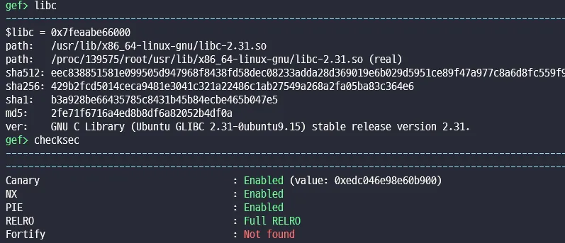
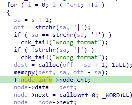
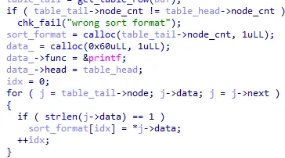
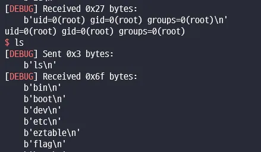

# [Dreamhack] Eztable



```c
int __fastcall main()
{
  unsigned int idx2; // [rsp+8h] [rbp-A8h]
  int i; // [rsp+Ch] [rbp-A4h]
  int idx; // [rsp+10h] [rbp-A0h]
  int k; // [rsp+14h] [rbp-9Ch]
  Node_info *table_head; // [rsp+18h] [rbp-98h]
  Node_info *table_tail; // [rsp+20h] [rbp-90h]
  Sdata *str; // [rsp+28h] [rbp-88h]
  struct Sdata *j; // [rsp+30h] [rbp-80h]
  char *buf1; // [rsp+38h] [rbp-78h]
  char *buf2; // [rsp+38h] [rbp-78h]
  char *buf; // [rsp+38h] [rbp-78h]
  char *sort_format; // [rsp+40h] [rbp-70h]
  Sprint *data_; // [rsp+48h] [rbp-68h]
  struct node_info *data[10]; // [rsp+50h] [rbp-60h]
  unsigned __int64 canary; // [rsp+A8h] [rbp-8h]

  canary = __readfsqword(0x28u);
  init();
  buf1 = getbuf();
  if ( !buf1 )
    chk_fail("get_row failed");
  table_head = get_table_row(buf1);
  for ( i = 0; i <= 9; ++i )
  {
    buf2 = getbuf();
    if ( !buf2 )
      chk_fail("get_row failed");
    data[i] = get_table_row_n(buf2, &table_head->node_cnt);
    idx2 = 0;
    for ( str = *(data[i] + 1); str->data; str = str->next )
      printf("%d-%d : %s\n", i, idx2++, str->data);
  }
  buf = getbuf();
  if ( !buf )
    chk_fail("get_row failed");
  table_tail = get_table_row(buf);
  if ( table_tail->node_cnt != table_head->node_cnt )
    chk_fail("wrong sort format");
  sort_format = calloc(table_tail->node_cnt, 1uLL);
  data_ = calloc(0x60uLL, 1uLL);
  data_->func = &printf;
  data_->head = table_head;
  idx = 0;
  for ( j = table_tail->node; j->data; j = j->next )
  {
    if ( strlen(j->data) == 1 )
      sort_format[idx] = *j->data;
    ++idx;
  }
  for ( k = 0; k <= 9; ++k )
    data_->data1[k] = data[k];
  table_print(sort_format, data_, data_->func);
  return 0;
}
```

```c
char *getbuf()
{
  size_t size; // [rsp+0h] [rbp-20h]
  char *src; // [rsp+8h] [rbp-18h]
  unsigned __int64 i; // [rsp+10h] [rbp-10h]
  char *dest; // [rsp+18h] [rbp-8h]

  size = 0x10LL;
  src = malloc(0x10uLL);
  if ( !src )
    chk_fail("calloc failed");
  for ( i = 0LL; src[i - 1] != 0xA; i += read(0, &src[i], 1uLL) )
  {
    if ( i > size - 1 )
    {
      dest = malloc(size + 0x100);
      if ( !dest )
        chk_fail("calloc failed");
      memcpy(dest, src, size);
      size += 0x100LL;
      free(src);
      src = dest;
    }
  }
  return src;
}
```

```c
Node_info *__fastcall get_table_row(char *buf)
{
  char *buf_; // [rsp+8h] [rbp-28h]
  char *sa; // [rsp+8h] [rbp-28h]
  struct Sdata *chunk; // [rsp+10h] [rbp-20h]
  Node_info *ptr; // [rsp+18h] [rbp-18h]
  char *off; // [rsp+20h] [rbp-10h]
  void *dest; // [rsp+28h] [rbp-8h]

  buf_ = buf;
  ptr = calloc(8uLL, 1uLL);
  ptr->node = calloc(0x10uLL, 1uLL);
  chunk = ptr->node;
  if ( buf != strchr(buf, '|') )
    chk_fail("wrong start format");
  do
  {
    sa = buf_ + 1;
    off = strchr(sa, '|');
    if ( sa == strchr(sa, '|') )
      chk_fail("wrong format");
    if ( !strchr(sa, '|') )
      chk_fail("wrong format");
    dest = calloc(off - sa + 1, 1uLL);
    memcpy(dest, sa, off - sa);
    ++ptr->node_cnt;
    chunk->data = dest;
    chunk->next = calloc(0x10uLL, 1uLL);
    chunk = chunk->next;
    buf_ = off;
  }
  while ( off[1] != 10 );
  return ptr;
}
```

```c
Node_info *__fastcall get_table_row_n(char *buf, unsigned __int16 *cnt)
{
  char *s; // [rsp+8h] [rbp-38h]
  char *sa; // [rsp+8h] [rbp-38h]
  int i; // [rsp+1Ch] [rbp-24h]
  Sdata *node; // [rsp+20h] [rbp-20h]
  Node_info *node_info; // [rsp+28h] [rbp-18h]
  char *off; // [rsp+30h] [rbp-10h]
  void *dest; // [rsp+38h] [rbp-8h]

  s = buf;
  node_info = calloc(0x10uLL, 1uLL);
  node_info->node = calloc(0x10uLL, 1uLL);
  node = node_info->node;
  if ( buf != strchr(buf, '|') )
    chk_fail("wrong start format");
  for ( i = 0; i < *cnt; ++i )
  {
    sa = s + 1;
    off = strchr(sa, '|');
    if ( sa == strchr(sa, '|') )
      chk_fail("wrong format");
    if ( !strchr(sa, '|') )
      chk_fail("wrong format");
    dest = calloc(off - sa + 1, 1uLL);
    memcpy(dest, sa, off - sa);
    ++node_info->node_cnt;
    node->data = dest;
    node->next = calloc(0x10uLL, 1uLL);
    node = node->next;
    s = off;
  }
  return node_info;
}
```

```c
__int64 __fastcall table_print(char *sort_format, Sprint *data, void (__fastcall *printf_)(__int64))
{
  int idx; // [rsp+20h] [rbp-20h]
  int j; // [rsp+24h] [rbp-1Ch]
  Sdata *i; // [rsp+28h] [rbp-18h]
  Sdata *k; // [rsp+30h] [rbp-10h]

  printf_(sort_format);
  puts("<table>");
  for ( i = *(data->head + 1); i->data; i = i->next )
    printf("<th>%s</th>", i->data);
  for ( j = 0; j <= 9; ++j )
  {
    printf("\n<tr>");
    idx = 0;
    for ( k = *(data->data1[j] + 1); k->data; k = k->next )
    {
      switch ( sort_format[idx] )
      {
        case 'l':
          printf("<td align=\"left\">%s</td>", k->data);
          break;
        case 'r':
          printf("<td align=\"right\">%s</td>", k->data);
          break;
        case 'c':
          printf("<td align=\"center\">%s</td>", k->data);
          break;
        default:
          chk_fail("wrong sort format");
      }
      ++idx;
    }
    printf("\n</tr>");
  }
  printf("\n</table>");
  return 0LL;
}
```

마지막 함수에서 printf 함수를 가져와 sort_format을 출력해준다.



node_cnt에 증가를 해주는데 이때 단위가 \_WORD이다.

2byte이므로 1 == 0x10001 이 성립한다.



head cnt와 tail cnt 비교에서 우회가 가능하고 sort_format 뒤에 printf func pointer가 들어가 잘 조합하면 덮을 수 있다.


