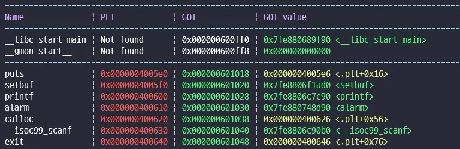
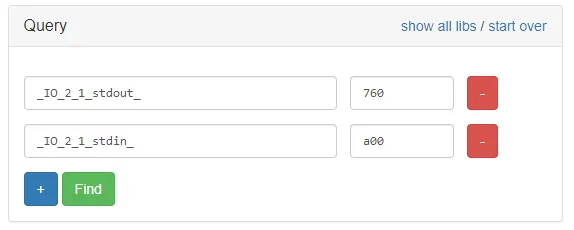
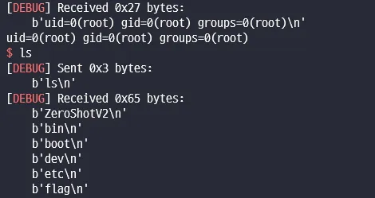

### [Dreamhack] ZeroShot

```c
int __fastcall main()
{
  int size; // [rsp+Ch] [rbp-24h] BYREF
  unsigned int offset; // [rsp+10h] [rbp-20h] BYREF
  char v3; // [rsp+14h] [rbp-1Ch] BYREF
  int *ptr; // [rsp+18h] [rbp-18h]
  int *ptr_; // [rsp+20h] [rbp-10h]
  char *v6; // [rsp+28h] [rbp-8h]

  ptr = 0LL;
  size = 0;
  offset = 0;
  ptr_ = 0LL;
  v6 = &v3;
  printf("size: ");
  __isoc99_scanf("%d", &size);
  if ( size > 255 )                             // 만약 터진다면 여기임
    exit(1);
  ptr = (int *)calloc((__int16)size, 4uLL);
  if ( (__int64)ptr <= 0x7F0000000000LL )
  {
    ptr_ = ptr;
    printf("offset: ");
    __isoc99_scanf("%d", &offset);
    printf("memory[%d]: ", offset);
    __isoc99_scanf("%d", &ptr_[offset]);
    puts("Done!");
  }
  return 0;
}

void setup()
{
  char v0; // [rsp+4h] [rbp-Ch] BYREF
  char *v1; // [rsp+8h] [rbp-8h]

  v1 = &v0;
  alarm(0x3Cu);
  setbuf(stdin, 0LL);
  setbuf(stdout, 0LL);
}
```

calloc에서 -1을 인자로 넘기면 ret 값이 null이 나온다 따라서 offset에 원하는 주소 / 4 를 넣으면 aaw가 가능하다.


puts | 0x0000004005e0 | 0x000000601018 | 0x0000004005e6 <.plt+0x16>  
setbuf | 0x0000004005f0 | 0x000000601020 | 0x7fd8e88d4ad0 <setbuf>  
printf | 0x000000400600 | 0x000000601028 | 0x7fd8e88aac90 <printf>  
alarm | 0x000000400610 | 0x000000601030 | 0x7fd8e892bd90 <alarm>  
calloc | 0x000000400620 | 0x000000601038 | 0x000000400626 <.plt+0x56>  
\_\_isoc99_scanf | 0x000000400630 | 0x000000601040 | 0x7fd8e88ac0b0 <\_\_isoc99_scanf>  
exit | 0x000000400640 | 0x000000601048 | 0x000000400646 <.plt+0x76>

1. puts_got -> main으로 변경하여 aaw 가능하게 만듦.
2. exit_got -> setup 함수로 변경. size가 255 넘을 경우 setup 함수 실행
3. setbuf -> main + ?? 변경

size 255 이상 넘길 경우 setup 함수에서 rdi, rax에 stdout 주소 가져옴

이렇게 넘길 경우 offset이 없어서 scanf에 에러가 터진다.

먼저 offset을 입력 후 puts에서 setup +0x?? 로 넘어간 후 alarm -> main + 0x??로 넘기면 offset이 초기화 되지 않아 입력이 가능해진다.

libc 주소 이걸로 추정 **libc6_2.27–3ubuntu1.4_amd64**


oneshot 가젯 맨 마지막을 맞추기 위해 stack을 조정한다.


