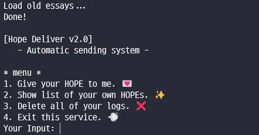

# [Dreamhack] Hope Delivery v2.0 💌




```c
if ( access("/tmp/hope_list", 0) == -1 )
  {
    puts("Error occured! Please call service administrator.");
    exit(-1);
  }
  stream = fopen("/tmp/hope_list/name.txt", "r");
  if ( !stream )
  {
    puts("name.txt does not exist.");
    puts("creating..");
    sleep(1u);
    stream = fopen("/tmp/hope_list/name.txt", "w");
    fclose(stream);
    puts("process complete!\n\n");
  }
  while ( 1 )
  {
    rb = fgetc(stream);
    if ( rb == -1 )
      break;
    if ( rb == 10 )
      ++line_cnt;
  }
  fclose(stream);
  puts("Load old essays...");
  stream = fopen("/tmp/hope_list/name.txt", "r");
  for ( i = 0; i < line_cnt; ++i )
  {
    memset(buf, 0, 0x21uLL);
    fgets(buf, 0x22, stream);
    buf[strcspn(buf, "\n")] = 0;
    sprintf(filename, "/tmp/hope_list/%s", buf);
    fd_lst = (__int64)fopen(filename, "r");
    if ( !fd_lst )
    {
      fclose(stream);
      puts("???????");
      remove_file("/tmp/hope_list", 1u);
      exit(-1);
    }
    v0 = mem_cnt;
    encryp_name[v0] = malloc(0x21uLL);
    v1 = mem_cnt++;
    strcpy((char *)encryp_name[v1], buf);
  }
  sleep(1u);
  return puts("Done!\n");
```

실행 될 때 init 함수안에 dir 체크가 진행되어 기존의 essay들이 저장된 경로들의 내용을 불러온다.

give_hope를 선택하면 받는 사람과 essay를 입력받는다

```c
memset(receiver, 0, 0x80uLL);
  if ( mem_cnt > 29 )
  {
    puts("Memories are full!");
    exit(0);
  }
  puts("\nQ1. Who receives this HOPE? (max length - 128bytes)");
  printf("Your Input: ");
  __isoc99_scanf(" %128s", receiver);
  encrypte_recev(receiver, encrypted);
  sprintf(path, "/tmp/hope_list/%s", encrypted);
  stream = fopen(path, "r");
  if ( stream )
  {
    puts("\nYou already sent essay to this person.");
    puts("Would you like to send new one?");
    puts("If yes, you lose recent log.");
    printf("Your Input[Y/N]: ");
    __isoc99_scanf(" %c", &yn);
    if ( yn != 'Y' && yn != 'y' )
    {
      if ( yn == 'N' || yn == 'n' )
        puts("Okay, back to menu.\n\n");
      else
        puts("Invalid choice!\n\n");
      return;
    }
    chk = 1;
  }
  puts("\nQ2. What type do you want to send?");
  puts("1. Essay Writing");
  puts("2. Dots ASCII ART (under construction..)");
  printf("Your Input: ");
  __isoc99_scanf("%1d", &chose);
  if ( chose == 1 )
  {
    if ( !chk )
    {
      recv_len = strlen(receiver);
      idx = mem_cnt;
      recev_arr[idx] = (char *)malloc(recv_len + 1);
      v2 = strlen(receiver);
      snprintf(recev_arr[mem_cnt], v2 + 1, receiver);// format 없음
      stream = fopen("/tmp/hope_list/name.txt", "a");
      fputs(encrypted, stream);
      fputc(10, stream);
      fclose(stream);
      v3 = mem_cnt;
      encryp_name[v3] = malloc(0x21uLL);
      v4 = mem_cnt++;
      strcpy((char *)encryp_name[v4], encrypted);
    }
    stream = fopen(path, "w");
    puts("\n\nWrite your essay here. (type \"end\" to save)");
    getchar();
    while ( 1 )
    {
      fgets(buf, 256, stdin);
      if ( !strcmp(buf, "end\n") )
        break;
      fputs(buf, stream);
    }
    fclose(stream);
    puts("\nSend complete and your essay is saved in our pocket.");
    puts("You can check with show menu.\n\n");
  }
```

보내는 사람 이름을 recve_arr에 저장을 한 후 md5로 해쉬값을 얻는다. 이 해쉬값을 name.txt에 저장 후 경로로 만들어 에세이를 작성하고 저장한다.

```c
if ( mem_cnt )
  {
    printf("\n[!] To protect your privacy, receiver name will be obscured.");
    for ( i = 0; i < mem_cnt; ++i )
    {
      printf("\n[ESSAY No.%d]\n", (unsigned int)i);
      memset(buf, 0, 0x64uLL);
      sprintf((char *)buf, "/tmp/hope_list/%s", (const char *)encryp_name[i]);
      stream = fopen((const char *)buf, "r");
      if ( !stream )
      {
        puts("DO NOT HACK!");
        puts("All of logs are automatically deleted soon..");
        sleep(1u);
        delet_file();
        exit(0);
      }
      while ( fgets(data, 256, stream) )
        printf("%s", data);
      fclose(stream);
      putchar(10);
    }
    puts("\n[END]\n");
  }
```

show_essay를 실행하면 저장된 essay 만큼 암호화된 해쉬 값 경로에 따라 읽어 온다.

```c
  if ( mem_cnt )
  {
    if ( delete_once )
    {
      puts("\nYou can delete logs only once.\n\n");
    }
    else
    {
      puts("\nDelete old files...");
      sleep(1u);
      for ( i = 0; i < mem_cnt; ++i )
      {
        if ( recev_arr[i] )
          printf("[!] Delete (to %s)\n", recev_arr[i]);
      }
      sleep(1u);
      remove_file("/tmp/hope_list", 1u);        // rm -rf?
      puts("Creating name.txt ..");
      sleep(1u);
      stream = fopen("/tmp/hope_list/name.txt", "w");
      fclose(stream);
      puts("Complete.\n\n");
      mem_cnt = 0;
      ++delete_once;
    }
  }
  else
  {
    puts("\nhope_list is empty.\n\n");
  }
}
```

delete를 실행하면 실행하여 작성한 recev_arr를 읽어 온다. 그리고 hope_list 디렉토리 안의 파일 삭제 후 다시 세팅을 한다.

```c
 snprintf(recev_arr[mem_cnt], v2 + 1, receiver);// format 없음
```

먼저 snprintf의 인자 중 format 해주는 것이 없기 때문에 fsb로 libc, codebase, canary leak이 가능하다.

stack 중 stack 주소를 갖는 주소가 있어서 double fsb를 이용하여 스택에 libc 값을 만들어 준후 fsb로 값을 변경해 leak을 한다.

다른사람들은 hook 을 바꾼분들도 있지만 나는 libc_got를 바꾸었다,,
